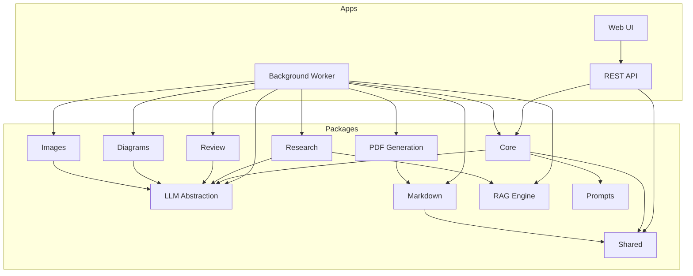

# BookForge AI

> AI-powered technical eBook publishing platform for researching, writing, reviewing, formatting, and publishing professional technical books.

---

## Table of Contents

- [Overview](#overview)
- [Features](#features)
- [Architecture](#architecture)
- [Project Structure](#project-structure)
- [Tech Stack](#tech-stack)
- [Quick Start](#quick-start)
- [Documentation](#documentation)
- [Roadmap](#roadmap)
- [Contributing](#contributing)
- [License](#license)

---

## Overview

BookForge AI automates the end-to-end creation of professional technical eBooks. It combines LLM-powered research and writing with structured pipelines that produce publication-ready PDF output. The platform supports multiple LLM backends, enforces rigorous review cycles, and generates diagrams, images, and formatted markdown automatically.

Only technical topics in AI, infrastructure, and software engineering are supported.

---

## Features

- **Automated Research** — Gathers and synthesises technical content from multiple sources
- **LLM-Powered Writing** — Generates chapters, sections, and code examples using configurable LLM providers
- **Multi-Provider LLM Abstraction** — Switch between NVIDIA NIM, OpenAI, Anthropic, or local models
- **Structured Review Pipeline** — Multi-stage review including technical accuracy, style, and consistency checks
- **Diagram Generation** — Produces architecture diagrams, flowcharts, and illustrations
- **PDF Publishing** — Compiles finished content into professional PDF output
- **RAG-Enhanced Context** — Retrieves relevant context from existing content to maintain coherence
- **Prompt Management** — Version-controlled, reusable prompt templates

---

## Architecture



---

## Project Structure

```
bookforge-ai/
├── apps/
│   ├── api/          # REST API service
│   ├── web/          # Web user interface
│   └── worker/       # Background task processor
├── packages/
│   ├── core/         # Core entities, business logic, orchestration
│   ├── shared/       # Shared utilities, types, configuration
│   ├── llm/          # LLM provider abstraction layer
│   ├── research/     # Topic research and content gathering
│   ├── markdown/     # Markdown parsing, transformation, formatting
│   ├── pdf/          # PDF compilation and rendering
│   ├── review/       # Content review and quality checks
│   ├── rag/          # Retrieval-Augmented Generation engine
│   ├── diagrams/     # Automated diagram generation
│   ├── images/       # Image generation and processing
│   └── prompts/      # Prompt template management and versioning
├── docs/             # Project documentation
├── templates/        # Book, chapter, and section templates
├── books/            # Generated book output directory
├── assets/           # Static assets (fonts, styles, logos)
├── scripts/          # Utility scripts
├── docker/           # Docker configuration files
├── docker-compose.yml
├── Makefile
└── .env.example
```

---

## Tech Stack

| Layer | Technology |
|---|---|
| Language | Python 3.12+ |
| API Framework | FastAPI |
| Web UI | Next.js |
| Database | PostgreSQL |
| LLM Providers | NVIDIA NIM, OpenAI, Anthropic, Ollama |
| PDF Engine | WeasyPrint / Typst |
| Task Queue | Celery + Redis |
| Container | Docker + Docker Compose |
| Testing | pytest, ruff, mypy |

---

## Quick Start

```bash
# Clone the repository
git clone https://github.com/your-org/bookforge-ai.git
cd bookforge-ai

# Configure environment
cp .env.example .env

# Start services
docker compose up -d

# Run database migrations
make migrate

# Ingest sample book template
make seed
```

> Full setup instructions are available in [docs/CONTRIBUTING.md](docs/CONTRIBUTING.md).

---

## Documentation

| Document | Description |
|---|---|
| [Project Specification](docs/PROJECT_SPECIFICATION.md) | Full project scope, vision, and constraints |
| [Architecture](docs/ARCHITECTURE.md) | System architecture, components, and data flow |
| [Roadmap](docs/ROADMAP.md) | Development phases and future plans |
| [Workflow](docs/WORKFLOW.md) | End-to-end book creation workflow |
| [Pipeline](docs/PIPELINE.md) | Data pipeline stages and transformations |
| [LLM](docs/LLM.md) | LLM abstraction layer and provider configuration |
| [API](docs/API.md) | REST API endpoints and usage |
| [Database](docs/DATABASE.md) | Schema, models, and data persistence |
| [Prompts](docs/PROMPTS.md) | Prompt management and versioning |
| [Security](docs/SECURITY.md) | Security policies and best practices |
| [Coding Standards](docs/CODING_STANDARDS.md) | Code style, conventions, and quality gates |
| [Contributing](docs/CONTRIBUTING.md) | Development setup and contribution process |

---

## Roadmap

| Phase | Focus |
|---|---|
| **01 — Foundation** | Project structure, documentation, CI/CD, templates |
| **02 — Core Pipeline** | Research, writing, markdown, PDF pipeline |
| **03 — Intelligence** | LLM integration, RAG, review, prompts |
| **04 — Production** | API, web UI, deployment, monitoring |

See [docs/ROADMAP.md](docs/ROADMAP.md) for details.

---

## Contributing

Please read [docs/CONTRIBUTING.md](docs/CONTRIBUTING.md) and [docs/CODING_STANDARDS.md](docs/CODING_STANDARDS.md) before submitting contributions.

---

## License

MIT License. See `LICENSE` for details.
