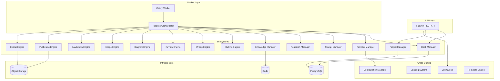

# BookForge AI

> AI-powered technical eBook publishing platform.

---

## Table of Contents

- [Overview](#overview)
- [Architecture](#architecture)
- [Subsystems](#subsystems)
- [Provider Manager](#provider-manager)
- [Project Structure](#project-structure)
- [Tech Stack](#tech-stack)
- [Quick Start](#quick-start)
- [Documentation](#documentation)
- [Pipeline](#pipeline)
- [Roadmap](#roadmap)
- [Contributing](#contributing)
- [License](#license)

---

## Overview

BookForge AI is a production-grade platform that transforms a technical book specification into a publication-ready PDF and EPUB through an automated pipeline of research, writing, review, diagramming, and rendering.

The platform only generates technical books. Allowed topics: AI, ML, LLMs, AI Agents, RAG, MLOps, DevOps, Kubernetes, Docker, Cloud, APIs, Databases, Software Engineering, Distributed Systems, Cybersecurity.

---

## Architecture



---

## Subsystems

| Subsystem | Responsibility |
|---|---|
| Book Manager | Book entity lifecycle, state machine, CRUD |
| Project Manager | Project container, collaborators, version tags |
| Provider Manager | LLM provider registry, health checks, circuit breaker, provider selection |
| Prompt Manager | Versioned prompt templates, rendering, usage tracking |
| Research Manager | Topic research, source synthesis, concept extraction |
| Knowledge Manager | RAG engine, embeddings, vector indexes, context retrieval |
| Outline Engine | Chapter outline generation from book specification |
| Writing Engine | Chapter content generation with context-aware prompting |
| Review Engine | Multi-stage quality checks (technical, style, structural, consistency) |
| Diagram Engine | Mermaid/PlantUML diagram generation from content descriptions |
| Image Engine | Cover and illustration image generation |
| Markdown Engine | Markdown parsing, normalisation, formatting, linting |
| Publishing Engine | PDF and EPUB compilation with styling |
| Export Engine | Output delivery, file packaging, storage management |

---

## Provider Manager

The Provider Manager is implemented in ``packages/llm/`` and provides:

- **``LLMProvider`` interface** — 6 methods: ``chat``, ``chat_stream``, ``embed``, ``embed_stream``, ``health``, ``list_models``
- **``ProviderRegistry``** — Register, get, list, unregister providers by name
- **``ModelRouter``** — Capability-based routing: primary → fallback → error
- **``CircuitBreaker``** — Opens after N consecutive failures, cooldown then half-open
- **``HealthChecker``** — Periodic health probes with TTL cache
- **``TokenBucketRateLimiter``** — Smooths request rates per provider
- **``RetryPolicy``** — Exponential backoff with ±25% jitter
- **Providers** — NVIDIA NIM adapter (primary), Ollama adapter (fallback)

```python
from bookforge.llm import ProviderManager
from bookforge.llm.models import Message, MessageRole

manager = ProviderManager.from_env()
await manager.start()
response = await manager.chat([
    Message(role=MessageRole.USER, content="Write a chapter...")
])
await manager.stop()
```

---

## Project Structure

```text
bookforge-ai/
├── apps/
│   ├── api/              # FastAPI REST API
│   ├── web/              # Next.js web dashboard
│   └── worker/           # Celery background worker
├── packages/
│   ├── core/             # Domain entities, pipeline orchestration
│   ├── shared/           # Types, utilities, base classes
│   ├── llm/              # Provider abstraction layer
│   │   ├── src/bookforge/llm/
│   │   │   ├── interfaces.py      # LLMProvider ABC
│   │   │   ├── base.py            # BaseProvider
│   │   │   ├── models.py          # Request/response types
│   │   │   ├── errors.py          # Exception hierarchy
│   │   │   ├── config.py          # Pydantic Settings
│   │   │   ├── config_loader.py   # Config assembly
│   │   │   ├── registry.py        # Provider registry
│   │   │   ├── manager.py         # ProviderManager facade
│   │   │   ├── router.py          # ModelRouter
│   │   │   ├── health.py          # HealthChecker
│   │   │   ├── rate_limiter.py    # Token bucket limiter
│   │   │   ├── retry.py           # Retry policy
│   │   │   ├── circuit_breaker.py # Circuit breaker
│   │   │   ├── logging.py         # Structured logging
│   │   │   └── providers/
│   │   │       ├── nvidia.py      # NVIDIA NIM adapter
│   │   │       └── ollama.py      # Ollama adapter
│   │   └── tests/
│   ├── research/         # Research and content gathering
│   ├── markdown/         # Markdown processing
│   ├── pdf/              # PDF compilation
│   ├── review/           # Content review engine
│   ├── rag/              # RAG and knowledge management
│   ├── diagrams/         # Diagram generation
│   ├── images/           # Image generation
│   ├── writer/           # Writing engine (draft generation)
│   └── prompts/          # Prompt template management
├── config/               # YAML configuration files
├── docs/                 # Architecture and design documentation
├── templates/            # Book, chapter, and section templates
├── books/                # Generated book output
├── assets/               # Static assets
├── scripts/              # Utility scripts
├── docker/               # Docker configurations
├── docker-compose.yml
├── Makefile
└── .env.example
```

---

## Tech Stack

| Layer | Technology | Purpose |
|---|---|---|
| Language | Python 3.12+ | Runtime |
| API Framework | FastAPI | REST API |
| Web UI | Next.js + TypeScript | User interface |
| Database | PostgreSQL 16 | Persistent state |
| Cache / Queue | Redis 7 | Caching + Celery broker |
| Task Queue | Celery | Async background processing |
| PDF Engine | WeasyPrint / Typst | PDF rendering |
| LLM Providers | NVIDIA NIM (primary), Ollama (fallback) | Content generation |
| Linting | ruff | Code quality |
| Types | mypy | Static type checking |
| Testing | pytest | Test framework |
| Container | Docker + Docker Compose | Development environment |

---

## Quick Start

```bash
git clone https://github.com/your-org/bookforge-ai.git
cd bookforge-ai
cp .env.example .env
docker compose up -d postgres redis
make migrate
make dev
```

---

## Documentation

| Document | Description |
|---|---|
| [Architecture](docs/ARCHITECTURE.md) | System architecture, subsystems, provider design |
| [Pipeline](docs/PIPELINE.md) | 13-stage book generation pipeline |
| [API](docs/API.md) | REST API endpoint catalog and contracts |
| [Database](docs/DATABASE.md) | Schema design, ERD, migration strategy |
| [Workflow](docs/WORKFLOW.md) | User-facing and system workflows |
| [Project Specification](docs/PROJECT_SPECIFICATION.md) | Vision, scope, constraints |
| [LLM Integration](docs/LLM.md) | Provider abstraction and configuration |
| [Prompts](docs/PROMPTS.md) | Prompt template system |
| [Security](docs/SECURITY.md) | Security policies |
| [Roadmap](docs/ROADMAP.md) | Development phases |
| [Coding Standards](docs/CODING_STANDARDS.md) | Code conventions |
| [Contributing](docs/CONTRIBUTING.md) | Contribution guide |

---

## Pipeline

```text
Book Request → Validation → Specification → Outline → Research →
Knowledge Base → Writing → Review → Diagrams → Cover →
Markdown → PDF → EPUB → Completed Book
```

---

## Provider Architecture

| Priority | Provider | Role |
|---|---|---|
| Primary | NVIDIA NIM | Default LLM provider for all generation |
| Fallback | Ollama | Local fallback when primary is unavailable |

**Pluggable:** New providers implement ``LLMProvider`` and register via ``ProviderRegistry.register()``.

---

## Roadmap

| Phase | Focus |
|-------|-------|
| 01 — Foundation | Project structure, documentation, templates |
| 02 — Architecture | System architecture, pipeline design, subsystem specification |
| 03 — Provider Manager | LLM abstraction layer, NVIDIA/Ollama adapters |
| 04 — Core Domain | Domain entities, value objects, enums, serialization |
| 05 — Configuration | Configuration system, environment loading, settings |
| 06 — Research Engine | Research planning, caching, deduplication, ranking |
| 07 — Book Planning | Book blueprint, chapter outlines, dependency graphs, learning paths |
| 08 — Writing Engine | Chapter/section generation, prompt composition, Markdown assembly, validation |
| 09 — Production | API, web UI, deployment, monitoring |

---

## Contributing

Please read [docs/CONTRIBUTING.md](docs/CONTRIBUTING.md) and [docs/CODING_STANDARDS.md](docs/CODING_STANDARDS.md).

---

## License

MIT License.
