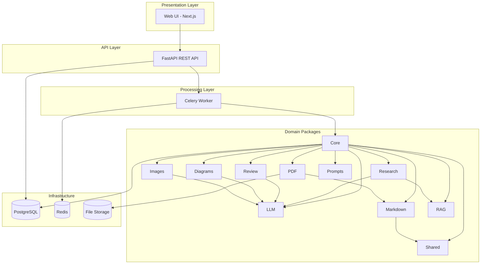
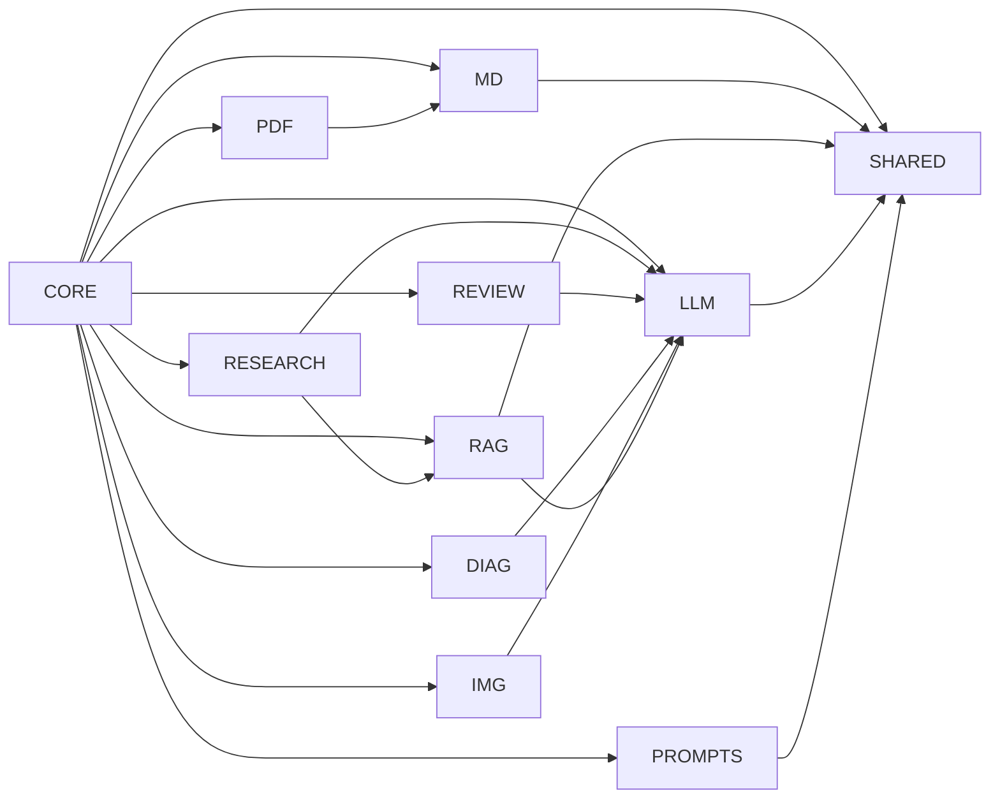
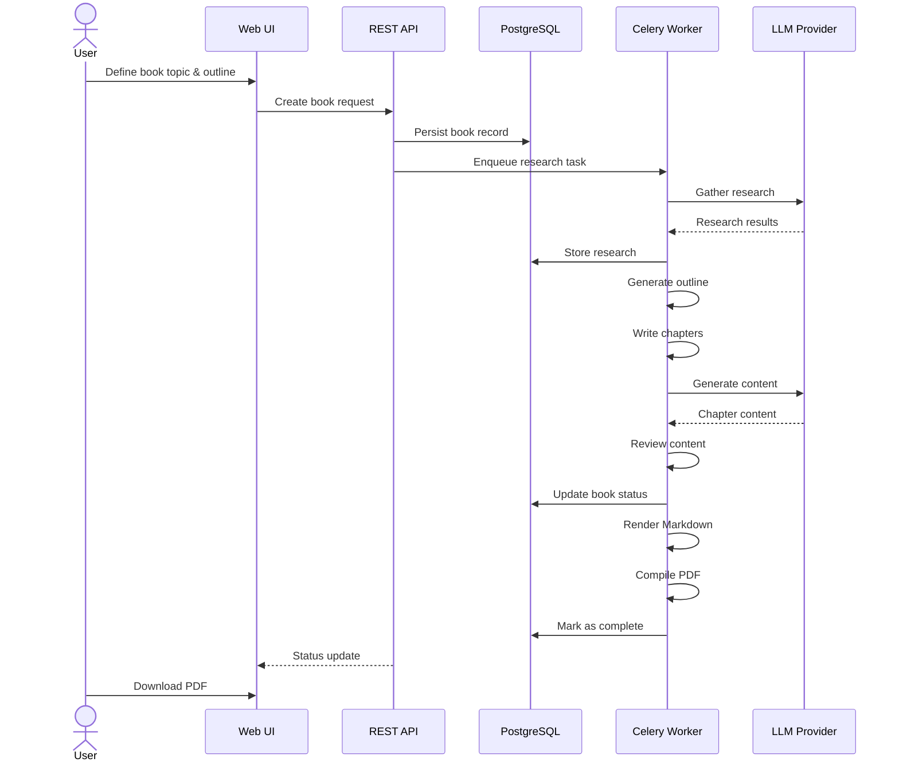

# Architecture

> System architecture, component design, and data flow for BookForge AI.

---

## Table of Contents

- [High-Level Architecture](#high-level-architecture)
- [Component Diagram](#component-diagram)
- [Layer Overview](#layer-overview)
- [Package Dependency Graph](#package-dependency-graph)
- [Data Flow](#data-flow)
- [Design Decisions](#design-decisions)

---

## High-Level Architecture

BookForge AI follows a modular monolith architecture with clear domain boundaries. The system is organised into three application tiers and eleven packages, each with a single responsibility.

---

## Layer Overview

### Presentation Layer

The **Web UI** is a Next.js application that provides the user-facing dashboard. It communicates exclusively with the REST API and does not access packages or databases directly.

### API Layer

The **REST API** (FastAPI) is the entry point for all user interactions. It handles authentication, request validation, and delegates long-running tasks to the worker. It also exposes endpoints for querying pipeline status and retrieving generated content.

### Processing Layer

The **Background Worker** (Celery) executes all pipeline stages asynchronously. Each pipeline stage is a Celery task that coordinates the relevant packages. This separation ensures the API remains responsive during long book generation runs.

### Domain Packages

The eleven packages contain all business logic. They are organised by domain concern and depend on each other through well-defined interfaces. The `core` package acts as the orchestrator, composing pipelines from lower-level packages.

---

## Package Dependency Graph

---

## Data Flow

---

## Design Decisions

### Why a modular monolith instead of microservices?

- The domain is cohesive — all packages serve the single goal of book generation
- Simpler deployment and development workflow
- Easy to extract individual services later if needed (packages are decoupled through interfaces)

### Why Celery for background tasks?

- Mature, well-documented task queue with rich monitoring (Flower)
- Native integration with Redis and PostgreSQL
- Reliable task retries, rate limiting, and scheduling

### Why an LLM abstraction layer?

- Multiple providers need to be supported (NVIDIA NIM, OpenAI, Anthropic, Ollama)
- Isolates business logic from provider-specific API details
- Enables provider fallback and A/B testing

### Why FastAPI?

- Native async support for concurrent request handling
- Automatic OpenAPI documentation generation
- Pydantic integration for robust request/response validation
