# Architecture

> Production system architecture for BookForge AI.

---

## Table of Contents

- [System Philosophy](#system-philosophy)
- [System Context Diagram](#system-context-diagram)
- [Container Diagram](#container-diagram)
- [Subsystem Catalog](#subsystem-catalog)
- [Provider Architecture](#provider-architecture)
- [Provider Manager Implementation](#provider-manager-implementation)
- [Configuration Architecture](#configuration-architecture)
- [Research Architecture](#research-architecture)
- [Book Planning Architecture](#book-planning-architecture)
- [Error Handling Architecture](#error-handling-architecture)
- [Event Flow](#event-flow)
- [Storage Architecture](#storage-architecture)
- [Sequence Diagrams](#sequence-diagrams)
- [Future Scalability](#future-scalability)
- [Architecture Decision Records](#architecture-decision-records)

---

## System Philosophy

BookForge AI follows a **modular event-driven monolith** architecture. Every concern is isolated into a dedicated subsystem with a single responsibility. Subsystems communicate through a central event bus and a shared job queue. This design allows future extraction into microservices without rewriting business logic.

**Design principles:**

| Principle | Rationale |
|---|---|
| Single Responsibility | Every subsystem does exactly one thing. When a subsystem needs to change, there is exactly one reason to change it. |
| Pluggable Providers | No hard-coded LLM provider. The provider layer is a registry — add an adapter, register it, and the system uses it. |
| Event-Driven | Subsystems never call each other directly. They emit events and react to events. This decouples producers from consumers. |
| Checkpoint Recovery | Every pipeline stage persists its output. A crash at stage 5 resumes at stage 5, not stage 1. |
| Configuration Over Code | Feature flags, provider selection, timeouts, retries — everything is configurable. No magic numbers, no hard-coded strings. |

---

## System Context Diagram

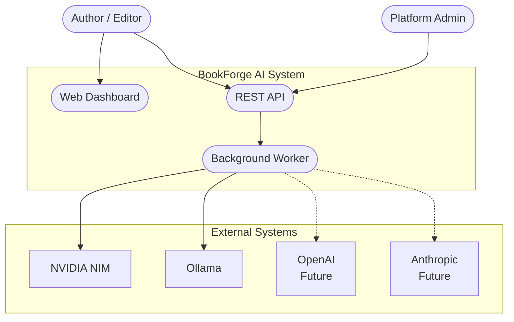

---

## Container Diagram

```mermaid
graph TB
    subgraph "API Container"
        API[FastAPI App]
        VAL[Validation Layer]
        AUTH[Authentication]
        RATE[Rate Limiter]
    end

    subgraph "Worker Container"
        CEL[Celery Worker]
        ORCH[Pipeline Orchestrator]
    end

    subgraph "Subsystems"
        BM[Book Manager]
        PM[Project Manager]
        PRM[Provider Manager]
        PTM[Prompt Manager]
        RM[Research Manager]
        KM[Knowledge Manager]
        OE[Outline Engine]
        WE[Writing Engine]
        RVE[Review Engine]
        DE[Diagram Engine]
        IE[Image Engine]
        ME[Markdown Engine]
        PBE[Publishing Engine]
        EE[Export Engine]
    end

    subgraph "Infrastructure"
        PG[(PostgreSQL)]
        RD[(Redis)]
        S3[(Object Storage)]
        FS[(File System Cache)]
    end

    subgraph "Cross-Cutting"
        CFG[Configuration Manager]
        LOG[Logging System]
        JQ[Job Queue]
        TE[Template Engine]
    end

    API --> AUTH
    API --> VAL
    API --> RATE
    API --> BM
    API --> PM
    API --> JQ

    CEL --> ORCH
    ORCH --> BM
    ORCH --> PM
    ORCH --> PRM
    ORCH --> PTM
    ORCH --> RM
    ORCH --> KM
    ORCH --> OE
    ORCH --> WE
    ORCH --> RVE
    ORCH --> DE
    ORCH --> IE
    ORCH --> ME
    ORCH --> PBE
    ORCH --> EE

    BM --> PG
    PM --> PG
    KM --> PG
    RM --> PG
    PBE --> S3
    EE --> S3
    ME --> FS

    BM --> JQ
    PM --> JQ
    PRM --> CFG
    PTM --> PG
    KM --> RD
    ORCH --> CFG
    ORCH --> LOG

    PRM -.-> NIM[NVIDIA NIM]
    PRM -.-> OLL[Ollama]
    PRM -.-> FUT[Future Providers]
```

---

## Provider Architecture

### Provider Manager Implementation

The Provider Manager is implemented in ``packages/llm/`` as a standalone Python package. It consists of:

| Module | Responsibility |
|---|---|
| ``interfaces.py`` | ``LLMProvider`` ABC with 6 methods, ``Capability`` enum |
| ``base.py`` | ``BaseProvider`` with defaults that raise ``ProviderError`` |
| ``models.py`` | ``ChatConfig``, ``ChatResponse``, ``Chunk``, ``Embedding``, ``HealthStatus``, ``Message`` |
| ``errors.py`` | ``ProviderError``, ``ProviderUnavailable``, ``AuthenticationError``, ``RateLimitError``, ``ProviderTimeout``, ``ConfigurationError``, ``InvalidProvider`` |
| ``config.py`` | Pydantic ``BaseSettings`` classes: ``LLMSettings``, ``ProviderSettings`` |
| ``config_loader.py`` | Assembles all sources into a ``RuntimeConfig`` dataclass |
| ``registry.py`` | ``ProviderRegistry`` — register, get, list, unregister |
| ``manager.py`` | ``ProviderManager`` — facade coordinating all subsystems |
| ``router.py`` | ``ModelRouter`` — capability-based routing with fallback |
| ``health.py`` | ``HealthChecker`` + ``HealthStatusCache`` — periodic health probes |
| ``rate_limiter.py`` | ``RateLimiter`` ABC + ``TokenBucketRateLimiter`` |
| ``retry.py`` | ``RetryPolicy`` + ``with_retry()`` async helper |
| ``circuit_breaker.py`` | ``CircuitBreaker`` — CLOSED → OPEN → HALF_OPEN |
| ``logging.py`` | Structured logging with trace IDs and subsystem tags |
| ``providers/nvidia.py`` | NVIDIA NIM adapter — OpenAI-compatible API format |
| ``providers/ollama.py`` | Ollama adapter — Ollama REST API format |

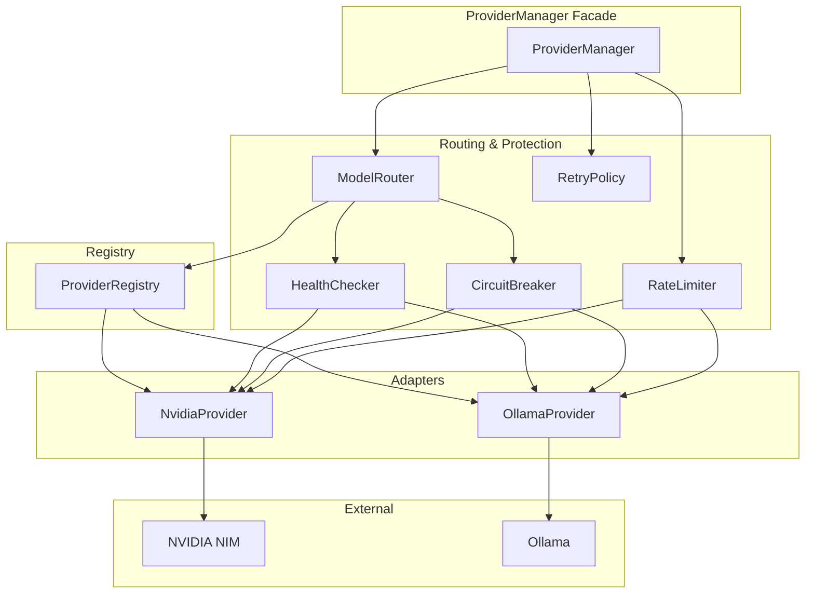

### Provider Interface

```python
class LLMProvider(ABC):
    @property
    def name(self) -> str: ...
    async def chat(self, messages, config) -> ChatResponse: ...
    async def chat_stream(self, messages, config) -> AsyncIterator[Chunk]: ...
    async def embed(self, texts, config) -> list[Embedding]: ...
    async def embed_stream(self, texts) -> AsyncIterator[Embedding]: ...
    async def health(self) -> HealthStatus: ...
    async def list_models(self) -> list[str]: ...
```

### Routing Strategy

```text
1. Consumer calls ProviderManager.chat(messages)
2. ProviderManager calls ModelRouter.route(Capability.CHAT)
3. ModelRouter finds RoutingRule for CHAT capability
4. Check primary (nvidia) circuit breaker: CLOSED?
   - NO → skip to fallback
5. Check primary health cache: HEALTHY?
   - NO → skip to fallback
6. Return primary provider
7. If fallback needed: check fallback health
   - HEALTHY → return fallback
   - UNHEALTHY → raise ProviderUnavailable
```

### Pluggability Contract

A new provider is added in three steps:

1. **Implement** ``LLMProvider`` in a new adapter module
2. **Register** via ``ProviderRegistry.register(adapter)``
3. **Configure** provider-specific environment variables

No existing code changes. No recompilation. No subsystem modification.

---

## Configuration Architecture

The Configuration & Settings layer is implemented in ``packages/config/`` as a standalone Python package. Every subsystem obtains its settings through this package — no module reads environment variables directly.

### Module Map

| Module | Responsibility |
|---|---|
| ``enums.py`` | ``Environment``, ``LogLevel``, ``LogFormat``, ``StorageBackend`` enums |
| ``environment.py`` | ``EnvironmentDetector`` — detects dev/test/staging/prod from env vars |
| ``features.py`` | ``FeatureFlags`` — toggle subsystems and experimental features |
| ``application.py`` | ``ApplicationSettings``, ``EnvironmentSettings`` — host, port, workers, CORS |
| ``providers.py`` | ``NvidiaSettings``, ``OllamaSettings``, ``ProviderSettings`` — LLM provider config |
| ``research.py`` | ``ResearchSettings`` — research engine concurrency, cache, quality |
| ``writer.py`` | ``WriterSettings`` — batch size, chunk size, temperature |
| ``review.py`` | ``ReviewSettings`` — review passes, thresholds, iterations |
| ``publishing.py`` | ``PublishingSettings`` — export formats, output directory |
| ``logging_.py`` | ``LoggingSettings`` — log level, format, rotation, trace IDs |
| ``storage.py`` | ``StorageSettings`` — local/S3/GCS/Azure storage config |
| ``security.py`` | ``SecuritySettings`` — API keys, JWT, CORS, rate limiting |
| ``loader.py`` | ``BookForgeConfig`` (aggregate), ``load_config()`` — entry point |
| ``validator.py`` | ``validate_settings()``, ``assert_valid_config()``, ``ConfigValidationError`` |
| ``cache.py`` | ``SettingsCache``, ``get_settings_cache()`` — cached singleton access |

### Settings Flow

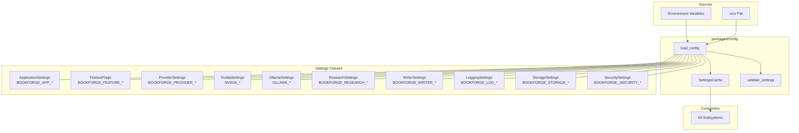

### Configuration Layers

| Layer | Priority | Scope |
|---|---|---|
| Environment variables | Highest | Deployment-specific overrides |
| ``.env`` file | Medium | Development defaults |
| Pydantic field defaults | Lowest | Sensible production defaults |

### Environment Variables by Settings Group

**Environment** — ``BOOKFORGE_`` prefix:

| Variable | Default | Description |
|---|---|---|
| ``BOOKFORGE_ENV`` | ``development`` | Runtime environment |

**Application** — ``BOOKFORGE_APP_`` prefix:

| Variable | Default | Description |
|---|---|---|
| ``BOOKFORGE_APP_NAME`` | ``bookforge`` | Application name |
| ``BOOKFORGE_APP_VERSION`` | ``1.0.0`` | Application version |
| ``BOOKFORGE_APP_DEBUG`` | ``true`` | Debug mode (auto-adjusted for prod) |
| ``BOOKFORGE_APP_HOST`` | ``0.0.0.0`` | Server host |
| ``BOOKFORGE_APP_PORT`` | ``8000`` | Server port |
| ``BOOKFORGE_APP_WORKERS`` | ``4`` | Worker processes |

**Provider** — ``BOOKFORGE_PROVIDER_``, ``NVIDIA_``, ``OLLAMA_`` prefixes:

| Variable | Default | Description |
|---|---|---|
| ``BOOKFORGE_PROVIDER_PRIMARY`` | ``nvidia`` | Primary provider |
| ``BOOKFORGE_PROVIDER_FALLBACK`` | ``ollama`` | Fallback provider |
| ``BOOKFORGE_PROVIDER_MAX_RETRIES`` | ``3`` | Max retry attempts |
| ``BOOKFORGE_PROVIDER_RETRY_BACKOFF`` | ``2.0`` | Exponential backoff factor |
| ``BOOKFORGE_PROVIDER_RETRY_JITTER`` | ``0.25`` | Jitter fraction (±25%) |
| ``NVIDIA_NIM_API_KEY`` | — | NVIDIA NIM API key |
| ``NVIDIA_NIM_BASE_URL`` | ``http://localhost:8000`` | NVIDIA NIM base URL |
| ``NVIDIA_NIM_MODEL`` | ``meta/llama-3.1-70b-instruct`` | Default NVIDIA model |
| ``OLLAMA_BASE_URL`` | ``http://localhost:11434`` | Ollama base URL |
| ``OLLAMA_MODEL`` | ``llama3.1`` | Default Ollama model |

**Feature Flags** — ``BOOKFORGE_FEATURE_`` prefix:

| Variable | Default | Description |
|---|---|---|
| ``BOOKFORGE_FEATURE_NVIDIA_ENABLED`` | ``true`` | Enable NVIDIA provider |
| ``BOOKFORGE_FEATURE_OLLAMA_ENABLED`` | ``true`` | Enable Ollama provider |
| ``BOOKFORGE_FEATURE_RESEARCH_ENABLED`` | ``true`` | Enable research engine |
| ``BOOKFORGE_FEATURE_WRITER_ENABLED`` | ``true`` | Enable writing engine |
| ``BOOKFORGE_FEATURE_PUBLISHING_ENABLED`` | ``true`` | Enable publishing engine |
| ``BOOKFORGE_FEATURE_DASHBOARD_ENABLED`` | ``true`` | Enable web dashboard |
| ``BOOKFORGE_FEATURE_EXPERIMENTAL_ENABLED`` | ``false`` | Enable experimental features |
| ``BOOKFORGE_FEATURE_FALLBACK_ENABLED`` | ``true`` | Enable provider fallback |
| ``BOOKFORGE_FEATURE_TELEMETRY_ENABLED`` | ``false`` | Enable anonymous telemetry |

**Other settings groups** — each with its own prefix:

| Prefix | Settings Class |
|---|---|
| ``BOOKFORGE_RESEARCH_`` | ``ResearchSettings`` |
| ``BOOKFORGE_WRITER_`` | ``WriterSettings`` |
| ``BOOKFORGE_REVIEW_`` | ``ReviewSettings`` |
| ``BOOKFORGE_PUBLISHING_`` | ``PublishingSettings`` |
| ``BOOKFORGE_LOG_`` | ``LoggingSettings`` |
| ``BOOKFORGE_STORAGE_`` | ``StorageSettings`` |
| ``BOOKFORGE_SECURITY_`` | ``SecuritySettings`` |

### Usage

```python
from bookforge.config import load_config, Environment

config = load_config()

host = config.application.host             # ApplicationSettings
port = config.application.port
name = config.application.name             # BOOKFORGE_APP_NAME
env = config.environment.env               # Environment.DEVELOPMENT
nvidia_key = config.nvidia.nim_api_key     # NvidiaSettings
feature = config.features.nvidia_enabled   # FeatureFlags
```

### Environment Detection

Detection order: ``BOOKFORGE_ENV`` → ``APP_ENV`` → ``ENVIRONMENT`` → fallback to ``development``.

```python
from bookforge.config.environment import EnvironmentDetector

detector = EnvironmentDetector()
env = detector.detect()                     # Environment enum
env = get_environment()                     # cached singleton
```

---

## Research Architecture

The Research Engine is implemented in ``packages/research/`` as a standalone Python package. It gathers, organizes, validates, and prepares technical knowledge before book writing. The engine operates independently of any specific LLM provider — all pipeline stages use rule-based heuristics.

### Module Map

| Module | Responsibility |
|---|---|
| ``enums.py`` | ``SourceType``, ``ResearchStatus``, ``RankCriterion``, ``SupportedInput`` |
| ``models.py`` | ``ResearchSource``, ``ResearchDocument``, ``ResearchSection``, ``ResearchPlan``, ``ResearchResult``, ``ResearchJob``, ``ResearchTask``, ``ResearchStatistics``, and sub-models (``KeyConcept``, ``Terminology``, ``CodeReference``, etc.) |
| ``cache.py`` | ``MemoryCache``, ``DiskCache`` — TTL-based caching for results and jobs |
| ``planner.py`` | ``ResearchPlanner`` — generates objectives, queries, and target source types from a topic |
| ``normalizer.py`` | ``ResearchNormalizer`` — extracts sections, cleans content, normalizes sources |
| ``deduplicator.py`` | ``ResearchDeduplicator`` — content fingerprinting via SHA-256 |
| ``ranker.py`` | ``ResearchRanker`` — rule-based scoring by authority, freshness, relevance, completeness |
| ``validator.py`` | ``ResearchValidator`` — checks duplicate sources, invalid URLs, missing metadata, empty summaries |
| ``exporter.py`` | ``ResearchExporter`` — dict, JSON, and summary representations of results |
| ``pipeline.py`` | ``ResearchPipeline`` — orchestrates the 6-stage pipeline in order |
| ``manager.py`` | ``ResearchManager`` — job lifecycle: create, start, cancel, list, track |
| ``engine.py`` | ``ResearchEngine`` — top-level entry point: ``engine.research(topic)`` |

### Pipeline

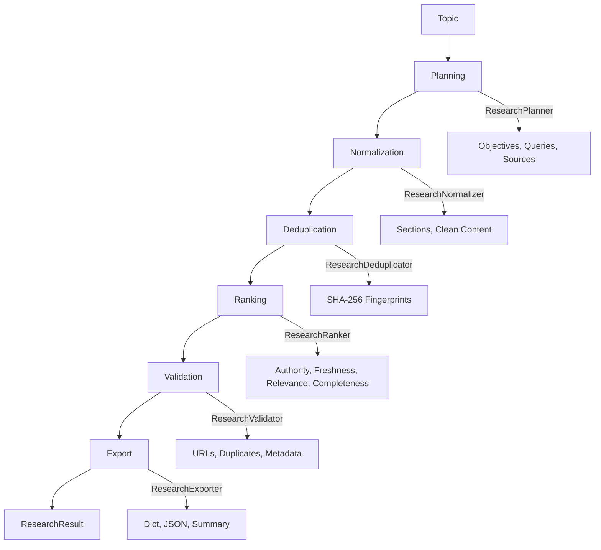

### Research Lifecycle

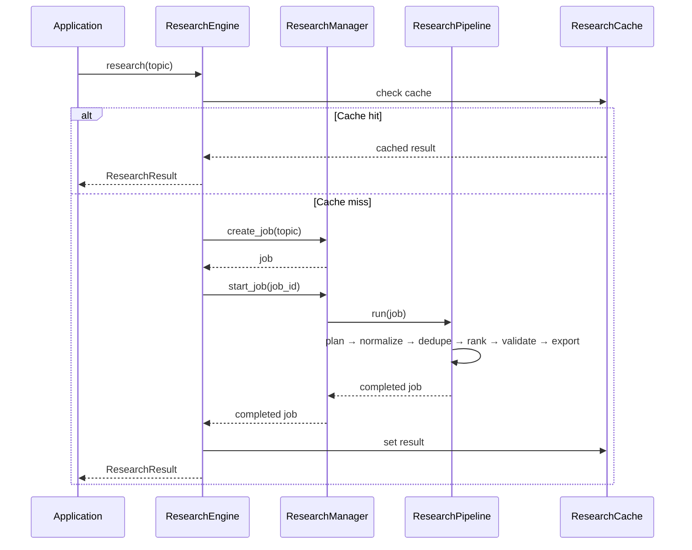

### Ranking Criteria

| Criterion | Weight | Implementation |
|---|---|---|
| Authority | 0.35 | Source type hierarchy: Specification > RFC > Book > Paper > Documentation > API > GitHub > Blog |
| Freshness | 0.20 | Source type decay rate (blogs decay fastest, books slowest) |
| Relevance | 0.30 | Keyword overlap between topic and title/content |
| Completeness | 0.15 | Title presence, content length, URL presence |

### Supported Inputs

All ``SupportedInput`` enum values have tailored source type mappings and query generation strategies:

| Input Type | Primary Sources | Example |
|---|---|---|
| ``TECHNICAL_TOPIC`` | Documentation, Blog, Book, Paper | "Kubernetes networking" |
| ``PROGRAMMING_LANGUAGE`` | Documentation, Specification, Book, Blog | "Rust" |
| ``FRAMEWORK`` | Documentation, GitHub, Blog, API | "React" |
| ``TECHNOLOGY`` | Documentation, RFC, Paper, Blog | "WebAssembly" |
| ``SOFTWARE_LIBRARY`` | Documentation, GitHub, API, Blog | "pandas" |
| ``API`` | API docs, Documentation, Specification, Blog | "REST API" |
| ``RFC`` | RFC, Documentation, Blog, Paper | "HTTP/3" |
| ``ARCHITECTURE`` | Book, Paper, Blog, Documentation | "Microservices" |

### Usage

```python
from bookforge.research import ResearchEngine, ResearchSource
from bookforge.research.enums import SourceType

engine = ResearchEngine()

# Full pipeline from topic
result = engine.research("Kubernetes networking")
print(result.summary)
for concept in result.key_concepts:
    print(f"  {concept.name}: {concept.definition}")

# With pre-collected sources
sources = [
    ResearchSource(
        id="k8s-net",
        title="Kubernetes Networking",
        source_type=SourceType.DOCUMENTATION,
        content="Documentation content...",
    ),
]
result = engine.research_with_sources("Kubernetes", sources)
```

### Architecture Decision Records

| ID | Decision | Rationale |
|---|---|---|
| ADR-014 | Rule-based pipeline stages | No external LLM dependency for research planning, normalization, deduplication, ranking, or validation. All stages use deterministic heuristics, making the engine testable and predictable. |
| ADR-015 | Content fingerprinting for deduplication | SHA-256 of title + content prefix. Deterministic, no state needed, no cross-source comparison overhead — each source is hashed independently. |
| ADR-016 | ``StrEnum`` for all research enums | ``StrEnum`` (Python 3.11+) ensures enum values are strings, enabling direct serialization to JSON and comparison with raw string values. |
| ADR-017 | Cache-aside pattern with TTL | Both ``MemoryCache`` and ``DiskCache`` follow the same ``ResearchCache`` ABC. TTL-based expiry avoids stale results without active eviction threads. |

---

## Book Planning Architecture

The `packages/planner` subsystem transforms structured research into a complete
technical book blueprint. It is a pure rule-based engine — no LLM calls, no
external APIs, no writing.

### Components

| Component | Package | Responsibility |
|---|---|---|
| `PlannerEngine` | `bookforge.planner.engine` | Facade — single entry point for all planning |
| `PlannerManager` | `bookforge.planner.manager` | Blueprint lifecycle (CRUD + planning) |
| `BookPlanner` | `bookforge.planner.planner` | Applies strategy chain to a blueprint |
| `OutlineValidator` | `bookforge.planner.validator` | Structural validation (duplicates, cycles, prerequisites) |
| `OutlineExporter` | `bookforge.planner.exporter` | Serialises blueprints to dict / JSON / YAML |
| `SequenceOptimizer` | `bookforge.planner.optimizer` | Prerequisite-aware chapter ordering |
| `AudienceAnalyzer` | `bookforge.planner.estimators` | Audience-level scoring from difficulty |

### Planning Pipeline

```
Blueprint (topic + chapter titles)
    │
    ▼
BookPlanner.generate_outline()  ──→  BookOutline (front matter, chapters, back matter)
    │
    ▼
BookPlanner.create_blueprint()  ──→  BookBlueprint (outline + estimates)
    │
    ▼
Strategies (chain of responsibility):
  • ProgressiveLearningStrategy   — topological sort + learning path
  • DependencyOrderedStrategy     — graph-based ordering
  • DifficultyProgressionStrategy — easy → hard
  • TopicClusteringStrategy       — group by topic area
    │
    ▼
SequenceOptimizer.optimize()     ──→  final chapter order + LearningPath
    │
    ▼
OutlineValidator.validate()      ──→  ValidationMessage list
    │
    ▼
OutlineExporter.{to_dict,to_json,to_yaml}()
```

### Key Design Decisions

1. **No LLM dependency** — the planner is deterministic. All chapter content
   fields are empty placeholders filled later by the Writing Engine.
2. **Dependency graph as source of truth** — chapter ordering is derived from
   the graph rather than from user-specified order.
3. **Strategy pattern** — planning strategies are composable and swappable.
4. **Validation-first** — blueprints are validated before export; errors are
   collected, not raised, to give a full picture of issues.

## Writing Engine Architecture

The Writing Engine is implemented in `packages/writer/` as a standalone Python package. It transforms a `BookBlueprint` (from the planner) and `ResearchResult` (from the research engine) into a `DraftBook` with structured Markdown content through provider-independent LLM generation.

### Module Map

| Module | Responsibility |
|---|---|
| `enums.py` | `WritingStatus`, `WritingStage`, `DraftQuality`, `ValidationSeverity` |
| `models.py` | `DraftBook`, `DraftChapter`, `DraftSection`, `WritingContext`, `WritingSession`, `WritingStatistics`, `WritingMetrics`, `WritingJob`, `ContentGenerator` ABC |
| `prompt_builder.py` | `PromptBuilder` — composes prompts from reusable `SYSTEM_PARTS` and `USER_PARTS` dictionaries; `PromptTemplate` — system/user pair with variable substitution |
| `prompt_renderer.py` | `PromptRenderer` — formats messages for provider consumption |
| `chapter_writer.py` | `ChapterWriter` — generates full chapter content |
| `section_writer.py` | `SectionWriter` — generates individual section content |
| `introduction_writer.py` | `IntroductionWriter` — prepends introductions to chapters |
| `conclusion_writer.py` | `ConclusionWriter` — appends conclusions to chapters |
| `glossary_writer.py` | `GlossaryWriter` — generates glossary definitions |
| `reference_writer.py` | `ReferenceWriter` — generates reference documentation |
| `code_example_writer.py` | `CodeExampleWriter` — standalone code examples |
| `table_writer.py` | `TableWriter` — Markdown tables |
| `assembler.py` | `MarkdownAssembler` — composes chapters, sections, front/back matter, glossary, references into a single Markdown document |
| `validator.py` | `ContentValidator` — validates output for empty content, duplicates, broken Markdown, invalid code fences, missing references |
| `exporter.py` | `WritingExporter` — exports drafts to Markdown, dict, JSON, file |
| `pipeline.py` | `WriterPipeline` — orchestrates all writer stages in order |
| `engine.py` | `WriterEngine` — top-level facade for all writing operations |
| `manager.py` | `WriterManager` — job/session lifecycle management |

### Writing Pipeline

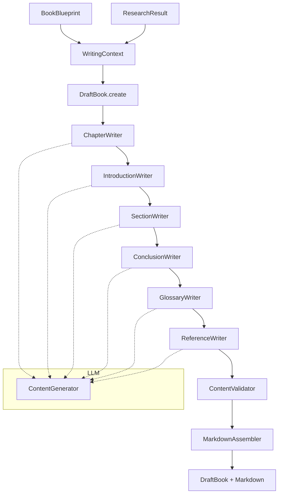

### Prompt Composition

Prompts are composed from reusable parts rather than hardcoded strings:

```python
# PromptBuilder composes system + user prompt parts
system_keys = ["role", "format", "headings", "code", "practical"]
user_keys = ["context", "audience", "chapter_context", "research", "word_count"]
system, user = self.build_prompt(system_keys, user_keys, **variables)
```

Parts are registered in `SYSTEM_PARTS` and `USER_PARTS` dictionaries and composed by key. This enables:
- Reuse of common instructions (format, code blocks, audience)
- Per-prompt-type variation (glossary vs chapter vs section)
- Variable substitution via `str.format()`

### Provider Integration

The Writing Engine integrates with LLM providers **only** through the `ContentGenerator` ABC:

```python
class ContentGenerator(ABC):
    @abstractmethod
    async def generate(self, prompt: str, **kwargs: Any) -> str: ...
    @abstractmethod
    async def generate_stream(self, prompt: str, **kwargs: Any) -> AsyncIterator[str]: ...
    @property
    @abstractmethod
    def name(self) -> str: ...
```

The application layer bridges `ContentGenerator` to `ProviderManager`:

```python
class LLMContentGenerator(ContentGenerator):
    def __init__(self, manager: ProviderManager):
        self._manager = manager

    async def generate(self, prompt: str, **kwargs) -> str:
        from bookforge.llm.models import Message, MessageRole
        response = await self._manager.chat(
            [Message(role=MessageRole.USER, content=prompt)],
        )
        return response.content
```

This ensures the writer is provider-independent — no direct dependency on NVIDIA, Ollama, or any specific LLM package.

### Content Validation

| Check | Severity | Description |
|---|---|---|
| Empty chapter | ERROR | Chapter has no content and no sections |
| Empty section | WARNING | Section has no written content |
| Duplicate section | ERROR | Two sections with the same heading in a chapter |
| Very short chapter | WARNING | Content under 50 words |
| H1 in chapter | WARNING | Chapter content uses H1 (should be H2+) |
| Invalid code fence | WARNING | Fence language specifier is not a valid identifier |
| Unclosed code fence | ERROR | Odd number of fence markers |
| Orphaned table separator | WARNING | `|---` line without preceding table header |
| Missing references | WARNING | Content references external resources but no references section |
| Empty front/back matter | WARNING | Front/back matter title with no content |

### Architecture Decision Records

| ID | Decision | Rationale |
|---|---|---|
| ADR-018 | ContentGenerator ABC for provider abstraction | The writer never imports from `bookforge.llm` directly. All LLM interaction goes through a single-method ABC that the application layer implements, keeping the writer testable and provider-agnostic. |
| ADR-019 | Prompt composition from parts | Prompts are built from registered `SYSTEM_PARTS`/`USER_PARTS` dictionaries by key rather than hardcoded as template strings. Enables reuse, variation, and easy modification without string manipulation. |
| ADR-020 | Separate writer modules per concern | Chapter writing, section writing, introductions, conclusions, glossary, references, code examples, and tables are each in their own module. The pipeline wires them together but any can be replaced independently. |

---

## Error Handling Architecture

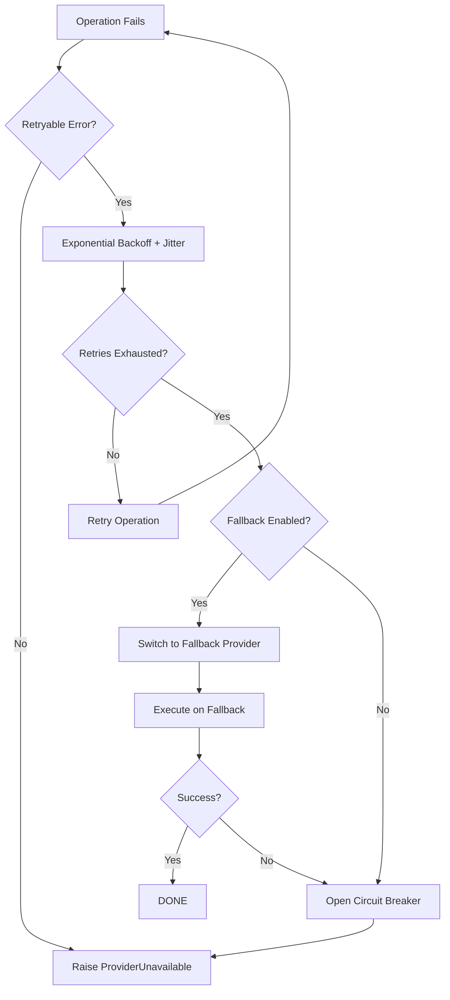

### Retry Strategy

| Failure Category | Max Retries | Backoff | Retryable |
|---|---|---|---|
| Network timeout | 3 | Exponential (2^N) | Yes |
| HTTP 429 (rate limit) | 5 | Linear (60s * N) | Yes |
| HTTP 5xx (server error) | 3 | Exponential (2^N) | Yes |
| Authentication failure | 0 | — | No |
| Invalid request (4xx) | 0 | — | No |

**Jitter:** Every retry delay is randomised by ±25% to prevent thundering herd.

### Fallback Strategy

```text
1. Primary provider fails after exhausting retries
2. Circuit breaker records failure (opens after threshold)
3. Select fallback provider from configuration
4. Execute operation on fallback provider
5. If fallback also fails → raise ProviderUnavailable
```

---

## Event Flow

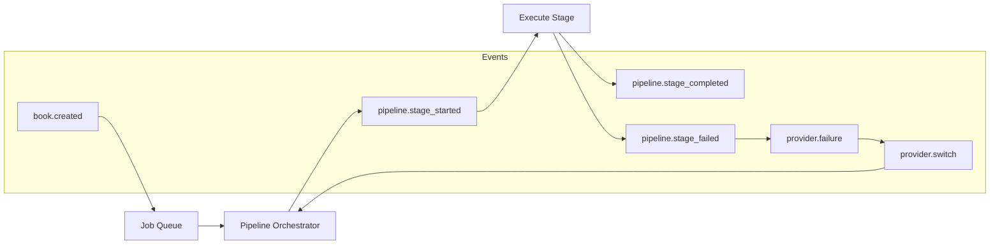

---

## Sequence Diagrams

### Provider Failure and Fallback

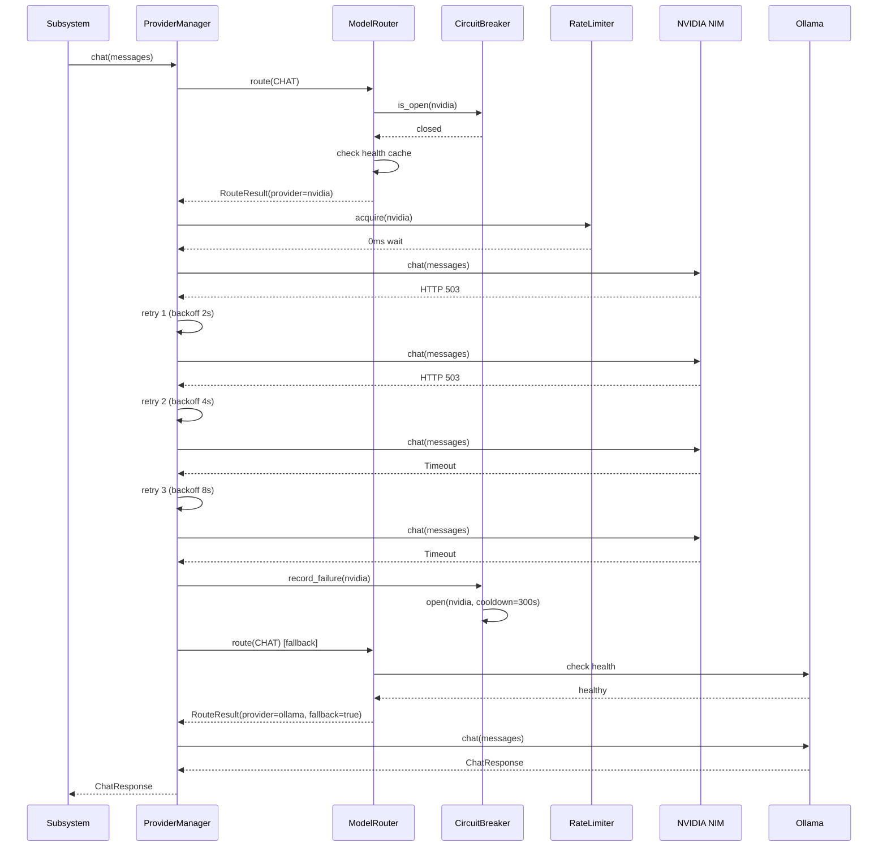

---

## Future Scalability

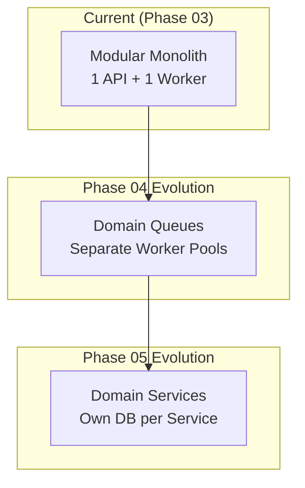

| Decision | Rationale |
|---|---|
| Start as a modular monolith | Faster iteration, simpler deployment, no distributed debugging. The subsystem boundaries make extraction trivial later. |
| Separate queues per workload | Pipeline stages have different latency and resource profiles. |
| Stateless workers | Workers hold no state between jobs. Any worker can pick up any job. |
| Event-driven orchestration | Events decouple stage producers from stage consumers. |

---

## Core Domain Layer

The Core Domain Layer is implemented in ``packages/core/`` as a standalone Python package. It defines every business entity that all subsystems depend on.

### Domain Model Diagram

```mermaid
classDiagram
    class Project {
        +id: str
        +name: str
        +description: str
        +books: list[Book]
        +created_at: datetime
        +updated_at: datetime
        +version: Version
    }
    class Book {
        +id: str
        +metadata: BookMetadata
        +specification: BookSpecification
        +settings: BookSettings
        +configuration: BookConfiguration
        +chapters: list[Chapter]
        +references: list[Reference]
        +glossary_terms: dict[str,str]
        +isbn: ISBN
    }
    class BookMetadata { title, subtitle, language, tags, edition }
    class BookSpecification { audience, difficulty, page_count, learning_objectives }
    class BookSettings { temperature, top_p, style_guide, tone }
    class BookConfiguration { status, stage, is_locked, timestamps, version }
    class Chapter { number, title, sections, introduction, summary }
    class Section { heading, paragraphs, code_examples, diagrams, images, tables }
    class Paragraph { text, style, is_code_block, list_type }
    class CodeExample { code, language, title, explanation }
    class Diagram { diagram_type, source, caption, alt_text }
    class ImageAsset { url, alt_text, dimensions }
    class Table { headers, rows, caption }
    class Reference { title, authors, year, type, doi, url }
    class Citation { reference_id, context, page_range, quotation }
    class Bibliography { references, style }
    class Author { name, email, bio, specialties }
    class PromptTemplate { name, template, variables, category }
    class Category { name, description, parent }
    class Tag { name, category }
    class LearningObjective { description, bloom_level, chapter }
    class PublishingInfo { isbn, publisher, edition, price }
    class ReviewInfo { reviewer, status, rating, comments }
    class ExportInfo { format, file_path, status, size }

    Project "1" *-- "many" Book
    Book "1" *-- "many" Chapter
    Book "1" *-- "many" Reference
    Chapter "1" *-- "many" Section
    Section "1" *-- "many" Paragraph
    Section "1" *-- "many" CodeExample
    Section "1" *-- "many" Diagram
    Section "1" *-- "many" ImageAsset
    Section "1" *-- "many" Table
    Section "1" *-- "many" Section : subsections
```

### Module Map

| Module | Contents |
|---|---|
| ``enums.py`` | Difficulty, Audience, Language, BookStatus, GenerationStage, ExportFormat, DiagramType, ReferenceType, AssetType, CodeLanguage, BloomLevel |
| ``value_objects.py`` | PersonName, EmailAddress, URL, ISBN, PageRange, Version, Color, ImageDimension |
| ``book.py`` | Project, Book, BookMetadata, BookSpecification, BookSettings, BookConfiguration, Chapter, Section |
| ``content.py`` | Paragraph, CodeExample, Diagram, ImageAsset, Table |
| ``reference.py`` | Reference, Citation, Bibliography |
| ``prompt.py`` | PromptTemplate |
| ``author.py`` | Author |
| ``taxonomy.py`` | Category, Tag, LearningObjective |
| ``publishing.py`` | PublishingInfo, ReviewInfo, ExportInfo |
| ``serialization.py`` | to_dict, from_dict, to_json, from_json, to_yaml, from_yaml |

### Validation Rules

- **Empty strings**: All `title`, `name`, `text`, `heading`, `id` fields reject empty or whitespace-only values
- **Unique constraints**: Chapter numbers within a book, book IDs within a project, reference IDs within a bibliography
- **Range checks**: Page counts ≥ 1, temperature 0.0–2.0, rating 1–5, indent 0–10
- **Format checks**: ISBN-10/13 checksum, email regex, URL scheme, hex color `#RRGGBB`
- **Structural**: Table row column counts must match header count

### Serialization

Every entity supports dict, JSON, and YAML:

```python
from bookforge.core.serialization import to_dict, to_json, to_yaml
from bookforge.core import Book, BookMetadata

book = Book(id="b1", metadata=BookMetadata(title="Python Deep Dive"))
d = to_dict(book)          # dict
j = to_json(book)          # JSON string
y = to_yaml(book)          # YAML string

from bookforge.core.serialization import from_dict, from_json, from_yaml
restored = from_dict(Book, d)
restored = from_json(Book, j)
restored = from_yaml(Book, y)
```

### Architecture Decision Records

| ID | Decision | Rationale |
|---|---|---|
| ADR-001 | ProviderManager as facade | All LLM access goes through a single entry point. Consistent retry, rate limiting, circuit breaking, and health checking without duplication across subsystems. |
| ADR-002 | Token bucket rate limiter | Smooths burst traffic better than fixed-window counters. Allows short bursts up to capacity while enforcing long-term average. |
| ADR-003 | Circuit breaker with half-open | Prevents cascading failures. Half-open state allows automatic recovery when the provider comes back. |
| ADR-004 | Pydantic Settings for configuration | Type-safe configuration loading. Automatic .env file support. Clear validation errors on misconfiguration. |
| ADR-005 | Provider adapters raise NotImplementedError for HTTP | Keeps the adapter layer pure — HTTP client injection is the integration boundary. Testable with mocks without real HTTP calls. |
| ADR-006 | Routing rules as data, not code | Routing policy is a list of ``RoutingRule`` dataclasses. Changing provider priority is a configuration change, not a code change. |
| ADR-007 | Pydantic v2 for domain models | Type-safe, immutable value objects via ``frozen=True``, built-in JSON/dict serialization, field validation with ``field_validator``, model-level validation with ``model_validator``. |
| ADR-008 | No custom base class | Domain models inherit directly from Pydantic ``BaseModel``. Avoids framework lock-in and keeps each model self-documenting. |
| ADR-009 | Clean Architecture layering | Enums and value objects depend on nothing. Domain entities depend on value objects and enums. Serialization is a standalone utility. No entity references infrastructure or application concerns. |
| ADR-010 | Centralized configuration package | Every subsystem reads settings through ``packages/config``. No module reads ``os.environ`` directly. Consistent env prefix scheme (``BOOKFORGE_*`` per group), Pydantic v2 validation at load time. |
| ADR-011 | Per-group env prefixes | Each settings group has a distinct prefix (``BOOKFORGE_APP_*``, ``BOOKFORGE_FEATURE_*``, ``NVIDIA_*``, etc.) avoiding collisions and making it clear which subsystem a variable belongs to. |
| ADR-012 | ``ClassVar`` for constants | ``DETECTION_ORDER`` on ``EnvironmentDetector`` uses ``ClassVar`` to satisfy mypy strict mode while keeping the list as a class-level constant. |
| ADR-013 | ``logging_`` module name | The logging settings module uses ``logging_`` (trailing underscore) to avoid shadowing Python's ``logging`` standard library module. |
