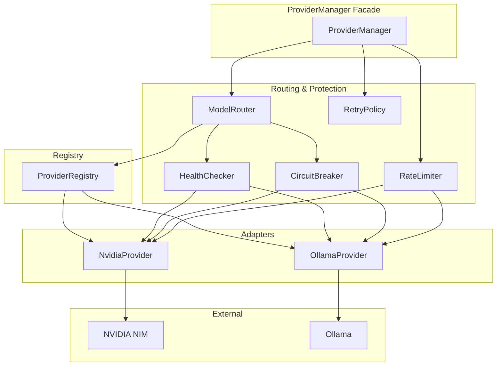
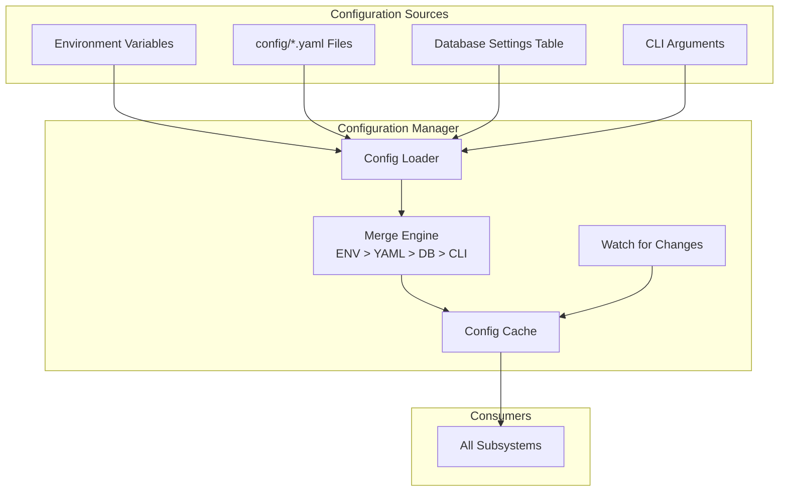
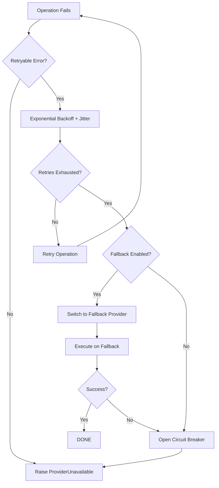
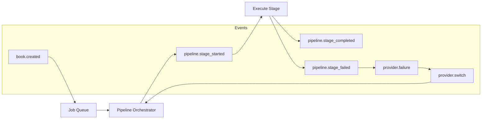
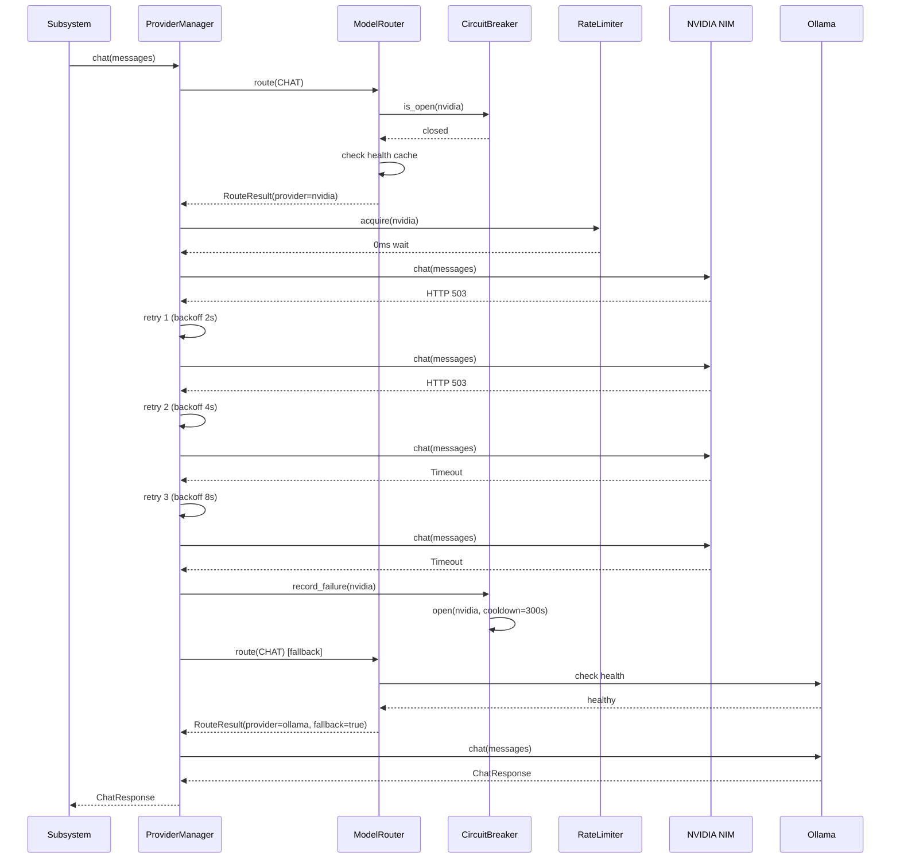
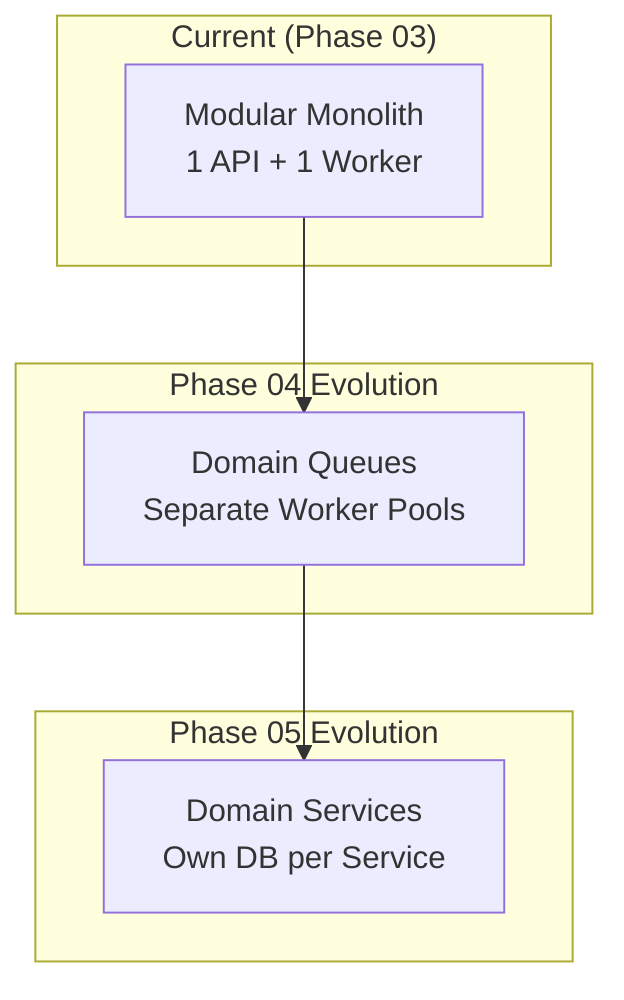

# Architecture

> Production system architecture for BookForge AI.

---

## Table of Contents

- [System Philosophy](#system-philosophy)
- [System Context Diagram](#system-context-diagram)
- [Container Diagram](#container-diagram)
- [Subsystem Catalog](#subsystem-catalog)
- [Provider Architecture](#provider-architecture)
- [Provider Manager Implementation](#provider-manager-implementation)
- [Configuration Architecture](#configuration-architecture)
- [Error Handling Architecture](#error-handling-architecture)
- [Event Flow](#event-flow)
- [Storage Architecture](#storage-architecture)
- [Sequence Diagrams](#sequence-diagrams)
- [Future Scalability](#future-scalability)
- [Architecture Decision Records](#architecture-decision-records)

---

## System Philosophy

BookForge AI follows a **modular event-driven monolith** architecture. Every concern is isolated into a dedicated subsystem with a single responsibility. Subsystems communicate through a central event bus and a shared job queue. This design allows future extraction into microservices without rewriting business logic.

**Design principles:**

| Principle | Rationale |
|---|---|
| Single Responsibility | Every subsystem does exactly one thing. When a subsystem needs to change, there is exactly one reason to change it. |
| Pluggable Providers | No hard-coded LLM provider. The provider layer is a registry — add an adapter, register it, and the system uses it. |
| Event-Driven | Subsystems never call each other directly. They emit events and react to events. This decouples producers from consumers. |
| Checkpoint Recovery | Every pipeline stage persists its output. A crash at stage 5 resumes at stage 5, not stage 1. |
| Configuration Over Code | Feature flags, provider selection, timeouts, retries — everything is configurable. No magic numbers, no hard-coded strings. |

---

## System Context Diagram


---

## Container Diagram

```mermaid
graph TB
    subgraph "API Container"
        API[FastAPI App]
        VAL[Validation Layer]
        AUTH[Authentication]
        RATE[Rate Limiter]
    end

    subgraph "Worker Container"
        CEL[Celery Worker]
        ORCH[Pipeline Orchestrator]
    end

    subgraph "Subsystems"
        BM[Book Manager]
        PM[Project Manager]
        PRM[Provider Manager]
        PTM[Prompt Manager]
        RM[Research Manager]
        KM[Knowledge Manager]
        OE[Outline Engine]
        WE[Writing Engine]
        RVE[Review Engine]
        DE[Diagram Engine]
        IE[Image Engine]
        ME[Markdown Engine]
        PBE[Publishing Engine]
        EE[Export Engine]
    end

    subgraph "Infrastructure"
        PG[(PostgreSQL)]
        RD[(Redis)]
        S3[(Object Storage)]
        FS[(File System Cache)]
    end

    subgraph "Cross-Cutting"
        CFG[Configuration Manager]
        LOG[Logging System]
        JQ[Job Queue]
        TE[Template Engine]
    end

    API --> AUTH
    API --> VAL
    API --> RATE
    API --> BM
    API --> PM
    API --> JQ

    CEL --> ORCH
    ORCH --> BM
    ORCH --> PM
    ORCH --> PRM
    ORCH --> PTM
    ORCH --> RM
    ORCH --> KM
    ORCH --> OE
    ORCH --> WE
    ORCH --> RVE
    ORCH --> DE
    ORCH --> IE
    ORCH --> ME
    ORCH --> PBE
    ORCH --> EE

    BM --> PG
    PM --> PG
    KM --> PG
    RM --> PG
    PBE --> S3
    EE --> S3
    ME --> FS

    BM --> JQ
    PM --> JQ
    PRM --> CFG
    PTM --> PG
    KM --> RD
    ORCH --> CFG
    ORCH --> LOG

    PRM -.-> NIM[NVIDIA NIM]
    PRM -.-> OLL[Ollama]
    PRM -.-> FUT[Future Providers]
```



---

## Provider Architecture

### Provider Manager Implementation

The Provider Manager is implemented in ``packages/llm/`` as a standalone Python package. It consists of:

| Module | Responsibility |
|---|---|
| ``interfaces.py`` | ``LLMProvider`` ABC with 6 methods, ``Capability`` enum |
| ``base.py`` | ``BaseProvider`` with defaults that raise ``ProviderError`` |
| ``models.py`` | ``ChatConfig``, ``ChatResponse``, ``Chunk``, ``Embedding``, ``HealthStatus``, ``Message`` |
| ``errors.py`` | ``ProviderError``, ``ProviderUnavailable``, ``AuthenticationError``, ``RateLimitError``, ``ProviderTimeout``, ``ConfigurationError``, ``InvalidProvider`` |
| ``config.py`` | Pydantic ``BaseSettings`` classes: ``LLMSettings``, ``ProviderSettings`` |
| ``config_loader.py`` | Assembles all sources into a ``RuntimeConfig`` dataclass |
| ``registry.py`` | ``ProviderRegistry`` — register, get, list, unregister |
| ``manager.py`` | ``ProviderManager`` — facade coordinating all subsystems |
| ``router.py`` | ``ModelRouter`` — capability-based routing with fallback |
| ``health.py`` | ``HealthChecker`` + ``HealthStatusCache`` — periodic health probes |
| ``rate_limiter.py`` | ``RateLimiter`` ABC + ``TokenBucketRateLimiter`` |
| ``retry.py`` | ``RetryPolicy`` + ``with_retry()`` async helper |
| ``circuit_breaker.py`` | ``CircuitBreaker`` — CLOSED → OPEN → HALF_OPEN |
| ``logging.py`` | Structured logging with trace IDs and subsystem tags |
| ``providers/nvidia.py`` | NVIDIA NIM adapter — OpenAI-compatible API format |
| ``providers/ollama.py`` | Ollama adapter — Ollama REST API format |



### Provider Interface

```python
class LLMProvider(ABC):
    @property
    def name(self) -> str: ...
    async def chat(self, messages, config) -> ChatResponse: ...
    async def chat_stream(self, messages, config) -> AsyncIterator[Chunk]: ...
    async def embed(self, texts, config) -> list[Embedding]: ...
    async def embed_stream(self, texts) -> AsyncIterator[Embedding]: ...
    async def health(self) -> HealthStatus: ...
    async def list_models(self) -> list[str]: ...
```

### Routing Strategy

```
1. Consumer calls ProviderManager.chat(messages)
2. ProviderManager calls ModelRouter.route(Capability.CHAT)
3. ModelRouter finds RoutingRule for CHAT capability
4. Check primary (nvidia) circuit breaker: CLOSED?
   - NO → skip to fallback
5. Check primary health cache: HEALTHY?
   - NO → skip to fallback
6. Return primary provider
7. If fallback needed: check fallback health
   - HEALTHY → return fallback
   - UNHEALTHY → raise ProviderUnavailable
```

### Pluggability Contract

A new provider is added in three steps:

1. **Implement** ``LLMProvider`` in a new adapter module
2. **Register** via ``ProviderRegistry.register(adapter)``
3. **Configure** provider-specific environment variables

No existing code changes. No recompilation. No subsystem modification.

---

## Configuration Architecture



### Configuration Layers

| Layer | Priority | Example | Scope |
|---|---|---|---|
| CLI arguments | Highest | `--log-level=debug` | Process |
| Environment variables | High | `LLM_PROVIDER=nvidia` | Deployment |
| YAML config files | Medium | `config/providers.yaml` | Environment |
| Database settings | Low | Feature flags | Runtime |

### LLM Environment Variables

| Variable | Default | Description |
|---|---|---|
| `LLM_PROVIDER` | `nvidia` | Primary provider |
| `LLM_FALLBACK_PROVIDER` | `ollama` | Fallback provider |
| `LLM_DEFAULT_MODEL` | — | Default chat model |
| `LLM_MAX_RETRIES` | `3` | Max retry attempts |
| `LLM_RETRY_BACKOFF_FACTOR` | `2.0` | Exponential backoff multiplier |
| `LLM_RETRY_MAX_DELAY` | `60.0` | Max backoff delay (seconds) |
| `LLM_RETRY_JITTER` | `0.25` | Jitter fraction (±25%) |
| `LLM_RATE_LIMIT_REQUESTS_PER_MINUTE` | `60` | Max requests/minute/provider |
| `LLM_RATE_LIMIT_TOKENS_PER_MINUTE` | `100000` | Max tokens/minute/provider |
| `LLM_HEALTH_CHECK_INTERVAL_SECONDS` | `60.0` | Health check interval |
| `LLM_HEALTH_CHECK_TIMEOUT_SECONDS` | `10.0` | Health check timeout |
| `LLM_CIRCUIT_BREAKER_THRESHOLD` | `5` | Failures before circuit opens |
| `LLM_CIRCUIT_BREAKER_COOLDOWN_SECONDS` | `300.0` | Cooldown before half-open |
| `NVIDIA_NIM_API_KEY` | — | NVIDIA NIM key |
| `NVIDIA_NIM_BASE_URL` | `http://localhost:8000` | NVIDIA NIM URL |
| `NVIDIA_NIM_MODEL` | `meta/llama-3.1-70b-instruct` | Default NVIDIA model |
| `OLLAMA_BASE_URL` | `http://localhost:11434` | Ollama URL |
| `OLLAMA_MODEL` | `llama3.1` | Default Ollama model |

---

## Error Handling Architecture



### Retry Strategy

| Failure Category | Max Retries | Backoff | Retryable |
|---|---|---|---|
| Network timeout | 3 | Exponential (2^N) | Yes |
| HTTP 429 (rate limit) | 5 | Linear (60s * N) | Yes |
| HTTP 5xx (server error) | 3 | Exponential (2^N) | Yes |
| Authentication failure | 0 | — | No |
| Invalid request (4xx) | 0 | — | No |

**Jitter:** Every retry delay is randomised by ±25% to prevent thundering herd.

### Fallback Strategy

```
1. Primary provider fails after exhausting retries
2. Circuit breaker records failure (opens after threshold)
3. Select fallback provider from configuration
4. Execute operation on fallback provider
5. If fallback also fails → raise ProviderUnavailable
```

---

## Event Flow



---

## Sequence Diagrams

### Provider Failure and Fallback



---

## Future Scalability



| Decision | Rationale |
|---|---|
| Start as a modular monolith | Faster iteration, simpler deployment, no distributed debugging. The subsystem boundaries make extraction trivial later. |
| Separate queues per workload | Pipeline stages have different latency and resource profiles. |
| Stateless workers | Workers hold no state between jobs. Any worker can pick up any job. |
| Event-driven orchestration | Events decouple stage producers from stage consumers. |

## Architecture Decision Records

| ID | Decision | Rationale |
|---|---|---|
| ADR-001 | ProviderManager as facade | All LLM access goes through a single entry point. Consistent retry, rate limiting, circuit breaking, and health checking without duplication across subsystems. |
| ADR-002 | Token bucket rate limiter | Smooths burst traffic better than fixed-window counters. Allows short bursts up to capacity while enforcing long-term average. |
| ADR-003 | Circuit breaker with half-open | Prevents cascading failures. Half-open state allows automatic recovery when the provider comes back. |
| ADR-004 | Pydantic Settings for configuration | Type-safe configuration loading. Automatic .env file support. Clear validation errors on misconfiguration. |
| ADR-005 | Provider adapters raise NotImplementedError for HTTP | Keeps the adapter layer pure — HTTP client injection is the integration boundary. Testable with mocks without real HTTP calls. |
| ADR-006 | Routing rules as data, not code | Routing policy is a list of ``RoutingRule`` dataclasses. Changing provider priority is a configuration change, not a code change. |
