# Architecture

> Production system architecture for BookForge AI.

---

## Table of Contents

- [System Philosophy](#system-philosophy)
- [System Context Diagram](#system-context-diagram)
- [Container Diagram](#container-diagram)
- [Subsystem Catalog](#subsystem-catalog)
- [Provider Architecture](#provider-architecture)
- [Configuration Architecture](#configuration-architecture)
- [Error Handling Architecture](#error-handling-architecture)
- [Event Flow](#event-flow)
- [Storage Architecture](#storage-architecture)
- [Job Queue Architecture](#job-queue-architecture)
- [Logging Architecture](#logging-architecture)
- [Sequence Diagrams](#sequence-diagrams)
- [Future Scalability](#future-scalability)
- [Architecture Decision Records](#architecture-decision-records)

---

## System Philosophy

BookForge AI follows a **modular event-driven monolith** architecture. Every concern is isolated into a dedicated subsystem with a single responsibility. Subsystems communicate through a central event bus and a shared job queue. This design allows future extraction into microservices without rewriting business logic.

**Design principles:**

| Principle | Rationale |
|---|---|
| Single Responsibility | Every subsystem does exactly one thing. When a subsystem needs to change, there is exactly one reason to change it. |
| Pluggable Providers | No hard-coded LLM provider. The provider layer is a registry — add an adapter, register it, and the system uses it. |
| Event-Driven | Subsystems never call each other directly. They emit events and react to events. This decouples producers from consumers. |
| Checkpoint Recovery | Every pipeline stage persists its output. A crash at stage 5 resumes at stage 5, not stage 1. |
| Configuration Over Code | Feature flags, provider selection, timeouts, retries — everything is configurable. No magic numbers, no hard-coded strings. |

---

## System Context Diagram

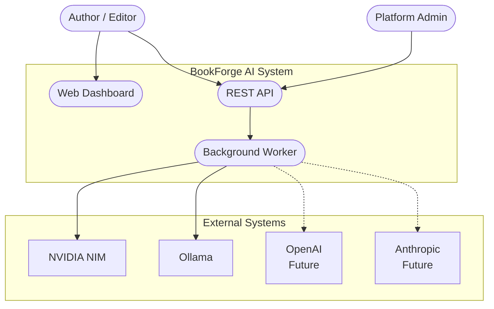

---

## Container Diagram

```mermaid
graph TB
    subgraph "API Container"
        API[FastAPI App]
        VAL[Validation Layer]
        AUTH[Authentication]
        RATE[Rate Limiter]
    end

    subgraph "Worker Container"
        CEL[Celery Worker]
        ORCH[Pipeline Orchestrator]
    end

    subgraph "Subsystems"
        BM[Book Manager]
        PM[Project Manager]
        PRM[Provider Manager]
        PTM[Prompt Manager]
        RM[Research Manager]
        KM[Knowledge Manager]
        OE[Outline Engine]
        WE[Writing Engine]
        RVE[Review Engine]
        DE[Diagram Engine]
        IE[Image Engine]
        ME[Markdown Engine]
        PBE[Publishing Engine]
        EE[Export Engine]
    end

    subgraph "Infrastructure"
        PG[(PostgreSQL)]
        RD[(Redis)]
        S3[(Object Storage)]
        FS[(File System Cache)]
    end

    subgraph "Cross-Cutting"
        CFG[Configuration Manager]
        LOG[Logging System]
        JQ[Job Queue]
        TE[Template Engine]
    end

    API --> AUTH
    API --> VAL
    API --> RATE
    API --> BM
    API --> PM
    API --> JQ

    CEL --> ORCH
    ORCH --> BM
    ORCH --> PM
    ORCH --> PRM
    ORCH --> PTM
    ORCH --> RM
    ORCH --> KM
    ORCH --> OE
    ORCH --> WE
    ORCH --> RVE
    ORCH --> DE
    ORCH --> IE
    ORCH --> ME
    ORCH --> PBE
    ORCH --> EE

    BM --> PG
    PM --> PG
    KM --> PG
    RM --> PG
    PBE --> S3
    EE --> S3
    ME --> FS

    BM --> JQ
    PM --> JQ
    PRM --> CFG
    PTM --> PG
    KM --> RD
    ORCH --> CFG
    ORCH --> LOG

    PRM -.-> NIM[NVIDIA NIM]
    PRM -.-> OLL[Ollama]
    PRM -.-> FUT[Future Providers]
```

---

## Subsystem Catalog

### Book Manager

| Attribute | Value |
|---|---|
| **Purpose** | Owns the book entity lifecycle. Creates, reads, updates, deletes, and tracks state transitions for every book. |
| **State Machine** | `draft → validating → valid → invalid → in_progress → completed → archived` |
| **Owns** | `books` table, book metadata, status transitions |
| **Emits** | `book.created`, `book.state_changed`, `book.completed`, `book.archived` |
| **Why separate?** | Every other subsystem needs to know the book's identity and status. Centralising book identity prevents fragmented state. |

### Project Manager

| Attribute | Value |
|---|---|
| **Purpose** | Manages the project wrapper around a book — collaboration settings, version tags, user assignments, and project-level configuration. A book is the content; a project is the container. |
| **Owns** | `projects` table, project membership, version history |
| **Emits** | `project.created`, `project.collaborator_added`, `project.version_tagged` |
| **Why separate?** | Book content and project management have different lifecycles. Separating them allows reusing the book pipeline for different project contexts. |

### Provider Manager

| Attribute | Value |
|---|---|
| **Purpose** | The LLM provider registry. Holds references to all registered providers, handles provider selection, health checking, and circuit breaking. No other subsystem talks to LLMs directly. |
| **Owns** | Provider registry, health status cache, circuit breaker state |
| **Registry** | Providers self-register on startup. The manager selects the active provider based on configuration and health. |
| **Why separate?** | Every subsystem that needs LLM access (research, writing, review, diagrams, images) would otherwise duplicate provider logic. Centralising it creates a single point of control for retries, fallbacks, and rate limiting. |

### Prompt Manager

| Attribute | Value |
|---|---|
| **Purpose** | Owns the prompt template lifecycle. Stores versioned templates, renders them with context variables, and tracks which template version produced which output. |
| **Owns** | `prompt_templates` table, template cache, render history |
| **Why separate?** | Prompt engineering is iterative. Versioned templates enable A/B testing, rollback, and audit trails for generated content. |

### Research Manager

| Attribute | Value |
|---|---|
| **Purpose** | Gathers and synthesises technical research for a book topic. Queries the Provider Manager for content, organises findings into a structured corpus. |
| **Owns** | `research_corpus` table, source references, key concepts |
| **Why separate?** | Research is a distinct cognitive load from writing. Separating it allows different prompt strategies and quality checks for research vs. prose. |

### Knowledge Manager

| Attribute | Value |
|---|---|
| **Purpose** | The RAG engine. Stores embeddings, manages vector indexes, and retrieves relevant context. Ensures cross-chapter consistency by surfacing related content during writing. |
| **Owns** | Vector indexes, embedding cache, `embeddings` table |
| **Why separate?** | RAG has unique infrastructure requirements (vector database, embedding models). Isolating it prevents those concerns from leaking into other subsystems. |

### Outline Engine

| Attribute | Value |
|---|---|
| **Purpose** | Generates a structured chapter-by-chapter outline from a book specification. Determines section depth, code example placement, and diagram insertion points. |
| **Why separate?** | Outline generation has a distinct input (spec) and output (structured outline). Its logic is self-contained and benefits from isolated iteration. |

### Writing Engine

| Attribute | Value |
|---|---|
| **Purpose** | Generates chapter content. Iterates over the outline, queries the Provider Manager for prose, consults the Knowledge Manager for cross-references, and persists chapter content. |
| **Why separate?** | The writing engine is the most complex subsystem. It coordinates prompts, knowledge, and provider access. Isolating it makes debugging and optimisation tractable. |

### Review Engine

| Attribute | Value |
|---|---|
| **Purpose** | Runs quality checks on generated content. Supports multiple review stages (technical, style, structural, consistency). Each stage produces a pass/fail verdict with findings. |
| **Owns** | `review_reports` table, review stage definitions |
| **Why separate?** | Review has a fundamentally different success criteria from generation. Combining them would couple "create content" with "judge content" — a conflated responsibility. |

### Diagram Engine

| Attribute | Value |
|---|---|
| **Purpose** | Generates diagrams from textual descriptions. Supports Mermaid and PlantUML output. Embeds diagram source and rendered output in chapter content. |
| **Why separate?** | Diagram generation requires specialised prompt templates and rendering tooling (Mermaid CLI, PlantUML). Isolating it prevents diagram concerns from complicating the writing engine. |

### Image Engine

| Attribute | Value |
|---|---|
| **Purpose** | Generates and processes images. Queries image-capable LLM providers or dedicated image models. Handles resolution, format conversion, and placement. |
| **Why separate?** | Image generation has unique latency, cost, and quality considerations. Separating it allows independent optimisation and provider selection. |

### Markdown Engine

| Attribute | Value |
|---|---|
| **Purpose** | Parses, normalises, lints, and formats markdown content. Enforces heading hierarchy, code block consistency, and cross-reference validity. Produces a publication-ready markdown artefact. |
| **Why separate?** | Markdown processing is pure transformation — no LLM calls. It is fast, deterministic, and testable. Isolating it keeps it simple. |

### Publishing Engine

| Attribute | Value |
|---|---|
| **Purpose** | Compiles formatted markdown into publication formats (PDF, EPUB). Manages cover generation, table of contents, typography, and output file assembly. |
| **Owns** | Output files in object storage |
| **Why separate?** | Publishing is the terminal stage. It depends on every prior stage being complete and stable. Isolating it allows independent rendering infrastructure. |

### Export Engine

| Attribute | Value |
|---|---|
| **Purpose** | Handles all output delivery — file download, archive packaging, metadata generation. Supports multiple export targets (local filesystem, S3-compatible storage). |
| **Why separate?** | Export concerns (compression, delivery, cleanup) are orthogonal to content generation. Separating them avoids entangling delivery logic with creation logic. |

---

## Provider Architecture

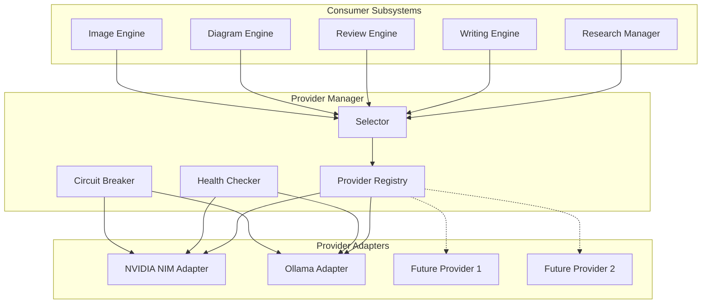

### Provider Selection Strategy

```
1. Consumer requests provider with capability (chat, embed, image)
2. Selector checks configured primary provider (default: NVIDIA NIM)
3. If primary is healthy → return primary adapter
4. If primary is unhealthy or circuit broken → check fallback (Ollama)
5. If fallback is healthy → return fallback adapter
6. If fallback is unhealthy → raise ProviderUnavailable
7. Selector caches selection for 60 seconds to reduce health-check load
```

### Provider Interface

Every provider adapter exposes the same five methods:

| Method | Input | Output | Purpose |
|---|---|---|---|
| `chat()` | `list[Message]`, `ChatConfig` | `ChatResponse` | Text generation |
| `chat_stream()` | `list[Message]`, `ChatConfig` | `AsyncIterator[Chunk]` | Streaming text generation |
| `embed()` | `list[str]` | `list[Embedding]` | Text embedding |
| `embed_stream()` | `AsyncIterator[str]` | `AsyncIterator[Embedding]` | Streaming embedding |
| `health()` | — | `HealthStatus` | Provider health check |

### Pluggability Contract

A new provider is added in three steps:

1. **Implement** the provider interface in a new adapter module
2. **Register** the adapter in the provider registry (decorator or config entry)
3. **Configure** provider-specific environment variables

No existing code changes. No recompilation. No subsystem modification.

---

## Configuration Architecture

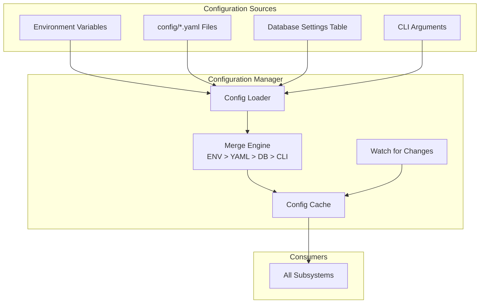

### Configuration Layers

| Layer | Priority | Example | Scope |
|---|---|---|---|
| CLI arguments | Highest | `--log-level=debug` | Process |
| Environment variables | High | `LLM_PROVIDER=nvidia` | Deployment |
| YAML config files | Medium | `config/providers.yaml` | Environment |
| Database settings | Low | Feature flags | Runtime |

### Configuration File Layout

```
config/
├── defaults.yaml          # Ship with repo, safe defaults
├── development.yaml       # Dev environment overrides
├── production.yaml        # Production environment overrides
├── providers.yaml         # Provider-specific configuration
├── pipeline.yaml          # Pipeline stage configuration
├── logging.yaml           # Logging levels and sinks
└── features.yaml          # Feature flags
```

### Environment Variables

| Variable | Description | Default |
|---|---|---|
| `BOOKFORGE_ENV` | Runtime environment | `development` |
| `BOOKFORGE_LOG_LEVEL` | Logging level | `INFO` |
| `LLM_PROVIDER` | Active LLM provider | `nvidia` |
| `LLM_FALLBACK_PROVIDER` | Fallback LLM provider | `ollama` |
| `LLM_DEFAULT_MODEL` | Default model for chat | — |
| `DATABASE_URL` | PostgreSQL connection string | — |
| `REDIS_URL` | Redis connection string | — |
| `STORAGE_BACKEND` | Storage backend type | `local` |
| `STORAGE_PATH` | Local storage path | `./books` |
| `S3_ENDPOINT` | S3-compatible endpoint | — |
| `S3_BUCKET` | S3 bucket name | — |
| `JOB_QUEUE_CONCURRENCY` | Worker concurrency | `4` |
| `NVIDIA_NIM_API_KEY` | NVIDIA NIM API key | — |
| `NVIDIA_NIM_BASE_URL` | NVIDIA NIM base URL | — |
| `OLLAMA_BASE_URL` | Ollama base URL | `http://localhost:11434` |

### Feature Flags

| Flag | Type | Description |
|---|---|---|
| `pipeline.research.enabled` | boolean | Enable research stage |
| `pipeline.review.enabled` | boolean | Enable review stage |
| `pipeline.diagrams.enabled` | boolean | Enable diagram generation |
| `pipeline.images.enabled` | boolean | Enable image generation |
| `pipeline.epub.enabled` | boolean | Enable EPUB output |
| `review.technical.enabled` | boolean | Enable technical review |
| `review.style.enabled` | boolean | Enable style review |
| `provider.fallback.enabled` | boolean | Enable provider fallback |

### Future Secrets Management

Secrets will be managed through an external secrets vault (HashiCorp Vault or AWS Secrets Manager) in production. The Configuration Manager will support a `vault:` URI scheme for secret references:

```yaml
provider:
  nvidia:
    api_key: vault://bookforge/nvidia/api_key
```

---

## Error Handling Architecture

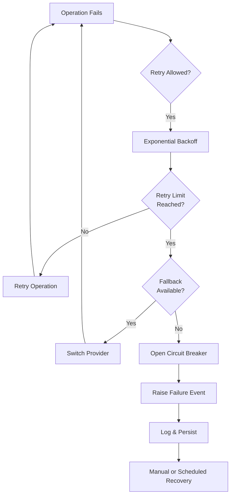

### Retry Strategy

| Failure Category | Max Retries | Backoff | Backoff Unit |
|---|---|---|---|
| Network timeout | 3 | Exponential (2^N) | Seconds |
| HTTP 429 (rate limit) | 5 | Linear (60s * N) | Seconds |
| HTTP 5xx (server error) | 3 | Exponential (2^N) | Seconds |
| Authentication failure | 0 | — | — |
| Invalid request (4xx) | 0 | — | — |

**Jitter:** Every retry delay is randomised by ±25% to prevent thundering herd.

### Fallback Strategy

```
1. Primary provider fails after exhausting retries
2. Log the failure with full context
3. Select fallback provider from configuration
4. Execute operation on fallback provider
5. Cache fallback decision for 300 seconds (avoids flip-flopping)
6. If fallback also fails → raise ProviderUnavailable
```

### Provider Switching

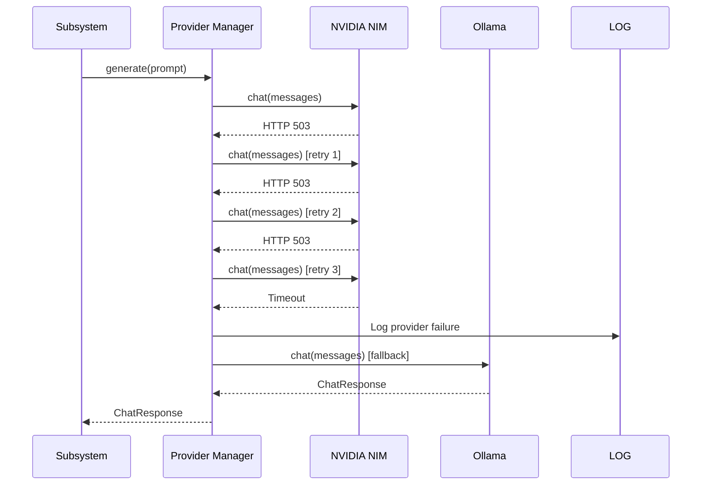

### Failure Recovery

**Checkpointing:**
- Every pipeline stage persists its output to the database before proceeding
- A pipeline crash is detected by a missing "completed" event for the current stage
- The orchestrator queries the last checkpoint and resumes from that stage

**Recovery Flow:**

1. Worker crashes mid-stage
2. New worker picks up the job from the queue
3. Orchestrator loads the pipeline context from the database
4. Orchestrator detects the last completed stage
5. Orchestrator resumes execution from the next incomplete stage

### Logging Architecture

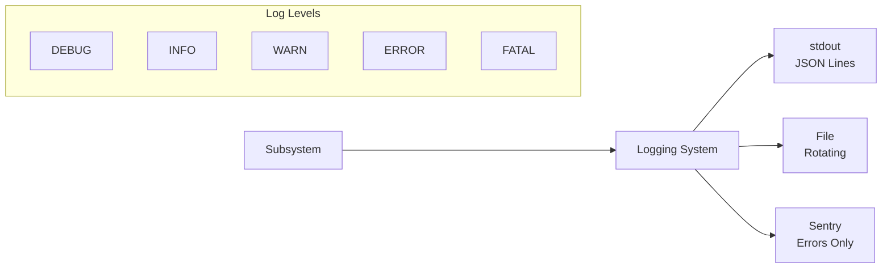

**Log format:** Every log line is a JSON object with a consistent schema:

```json
{
    "timestamp": "2026-07-26T14:30:00.123Z",
    "level": "ERROR",
    "logger": "bookforge.provider_manager",
    "trace_id": "trc_abc123",
    "subsystem": "provider_manager",
    "event": "provider.fallback.activated",
    "message": "NVIDIA NIM failed after 3 retries, falling back to Ollama",
    "context": {
        "primary_provider": "nvidia",
        "fallback_provider": "ollama",
        "retry_count": 3,
        "failure_reason": "HTTP 503"
    },
    "duration_ms": 45200
}
```

**Key logging principles:**
- Every log line has a `trace_id` for end-to-end request tracing
- Every log line identifies its `subsystem` and `event` name
- Sensitive data (API keys, user content) is never logged
- Error logs always include the failure context for debugging
- Production logs are JSON for structured ingestion (ELK, Grafana Loki)

---

## Event Flow

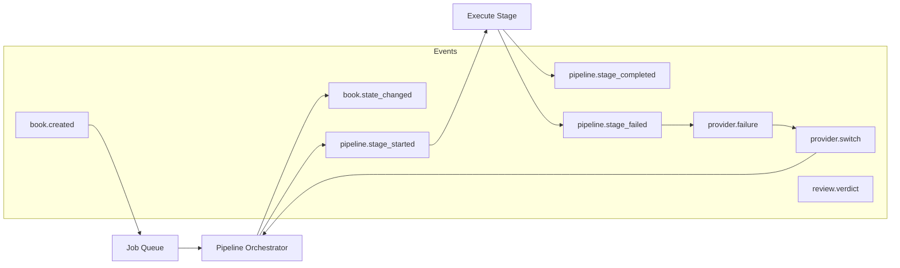

---

## Storage Architecture

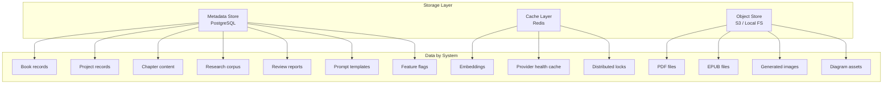

| Store | Technology | Data | Retention |
|---|---|---|---|
| Metadata | PostgreSQL 16 | Books, projects, chapters, research, reviews, templates, events | Indefinite |
| Cache | Redis 7 | Embeddings, provider health, rate limit counters, locks | Configurable TTL |
| Objects | S3 / Local FS | PDFs, EPUBs, images, diagram assets | Until book archived |

---

## Job Queue Architecture

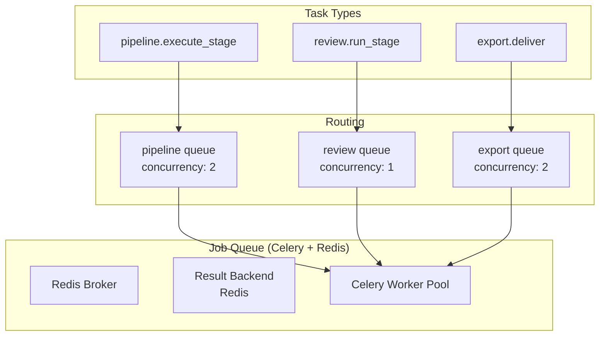

**Why Celery on Redis?**
- Mature, well-documented, vast ecosystem
- Native support for task routing, prioritisation, and rate limiting
- Redis is already in the stack for caching — no additional infrastructure
- Flower dashboard for monitoring (future dashboard integration)

---

## Sequence Diagrams

### Full Book Creation Flow

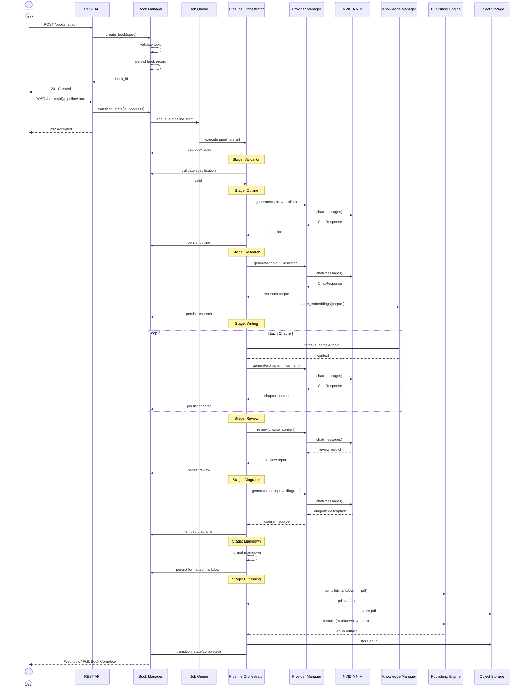

### Provider Failure and Fallback

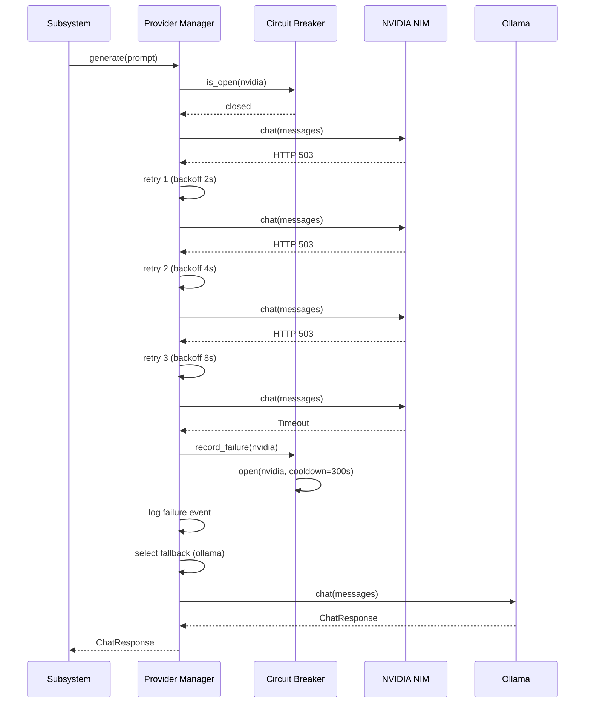

---

## Future Scalability

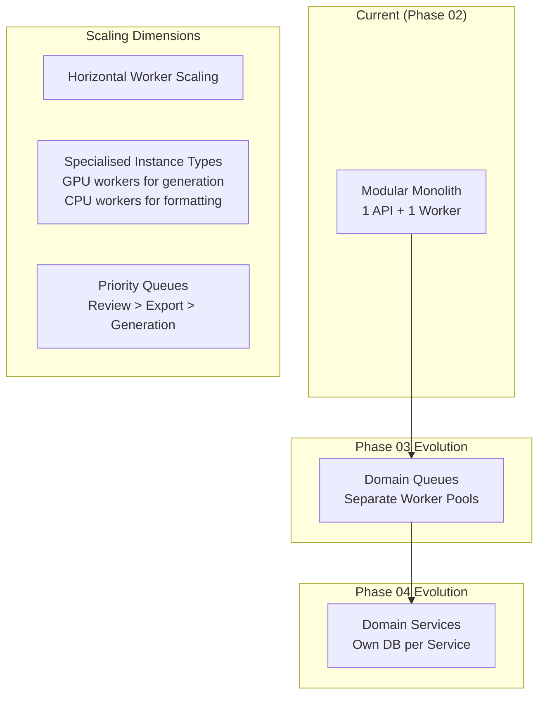

**Scalability decisions and rationale:**

| Decision | Rationale |
|---|---|
| Start as a modular monolith | Faster iteration, simpler deployment, no distributed debugging. The subsystem boundaries make extraction trivial later. |
| Separate queues per workload | Pipeline stages have different latency and resource profiles. Generation is GPU-bound; formatting is CPU-bound; export is IO-bound. Separate queues allow independent scaling. |
| Object storage for artifacts | PDFs and images are large binaries. Storing them in the database would bloat backups and slow queries. Object storage scales infinitely and cheaply. |
| Stateless workers | Workers hold no state between jobs. Any worker can pick up any job. This enables horizontal scaling with zero coordination. |
| Event-driven orchestration | Events decouple stage producers from stage consumers. A new stage can be inserted between existing stages without changing the orchestration code. |
