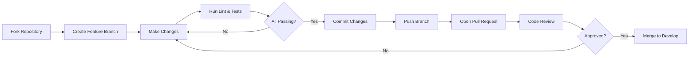

# Contributing

> Guide for contributing to BookForge AI.

---

## Table of Contents

- [Welcome](#welcome)
- [Development Setup](#development-setup)
- [Development Workflow](#development-workflow)
- [Branching Strategy](#branching-strategy)
- [Commit Conventions](#commit-conventions)
- [Pull Request Process](#pull-request-process)
- [Running Tests](#running-tests)
- [Code Quality](#code-quality)

---

## Welcome

Thank you for your interest in BookForge AI. This document outlines the process for contributing to the project. Please read [CODING_STANDARDS.md](CODING_STANDARDS.md) for detailed code style and quality requirements.

---

## Development Setup

### Prerequisites

- Python 3.12+
- Docker and Docker Compose
- UV package manager (recommended) or pip
- Git

### Step-by-Step

```bash
# 1. Fork and clone the repository
git clone https://github.com/your-username/bookforge-ai.git
cd bookforge-ai

# 2. Set up the virtual environment
python3.12 -m venv .venv
source .venv/bin/activate

# 3. Install dependencies
uv pip install -e "packages/core[dev]"
uv pip install -e "packages/shared[dev]"
# (repeat for other packages as needed)

# 4. Configure environment
cp .env.example .env
# Edit .env with your LLM provider keys (optional for local dev)

# 5. Start infrastructure services
docker compose up -d postgres redis

# 6. Run database migrations
make migrate

# 7. Verify setup
make lint
make test
```

---

## Development Workflow



---

## Branching Strategy

| Branch | Purpose | Base Branch |
|---|---|---|
| `main` | Production-ready code | — |
| `develop` | Integration branch | `main` |
| `feat/*` | New features | `develop` |
| `fix/*` | Bug fixes | `develop` |
| `docs/*` | Documentation | `develop` |
| `chore/*` | Maintenance | `develop` |

```bash
# Create a feature branch
git checkout develop
git checkout -b feat/my-feature
```

---

## Commit Conventions

All commits must follow [Conventional Commits](https://www.conventionalcommits.org/):

```
<type>(<scope>): <description>
```

**Types:** `feat`, `fix`, `docs`, `refactor`, `test`, `chore`, `style`

**Scopes:** Package or app name (e.g., `core`, `llm`, `api`, `docs`)

```
feat(core): add pipeline state machine
docs(api): document book creation endpoint
fix(llm): handle rate limit retry backoff
```

---

## Pull Request Process

1. Ensure your branch is up to date with `develop`
2. Run `make lint` and `make test` locally
3. Push your branch and open a PR against `develop`
4. Fill in the PR template with:
   - What the PR does
   - Which packages/apps are affected
   - Any breaking changes
   - Testing notes
5. Request review from at least one maintainer
6. Address all review feedback
7. Merge after approval (squash commit)

### PR Checklist

- [ ] Code follows coding standards
- [ ] Tests added/updated for new code
- [ ] All CI checks pass
- [ ] Documentation updated (if applicable)
- [ ] No placeholder code or TODOs
- [ ] PR is scoped to a single concern

---

## Running Tests

```bash
# Run all tests
make test

# Run tests for a specific package
cd packages/core && pytest

# Run with coverage
pytest --cov --cov-report=term-missing
```

---

## Code Quality

Before submitting, run:

```bash
# Format code
ruff format .

# Lint check
ruff check .

# Type check
mypy packages/

# Full quality check
make lint
```
