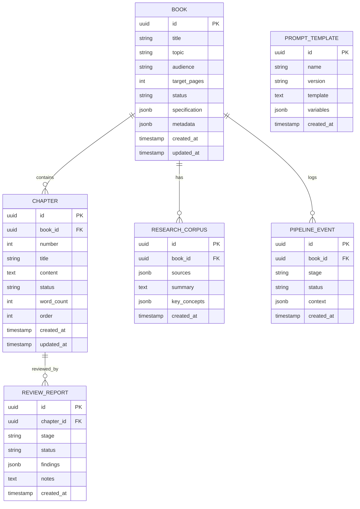
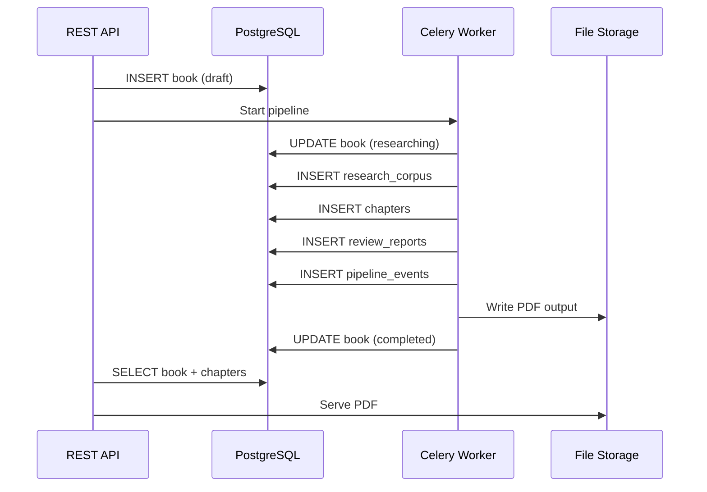

# Database

> Data model, schema design, and persistence strategy for BookForge AI.

---

## Table of Contents

- [Overview](#overview)
- [Entity Relationship Diagram](#entity-relationship-diagram)
- [Table Descriptions](#table-descriptions)
- [Migration Strategy](#migration-strategy)
- [Data Flow](#data-flow)

---

## Overview

BookForge AI uses PostgreSQL for persistent storage. The schema is designed around the book lifecycle, capturing state transitions and audit history at every stage.

---

## Entity Relationship Diagram

---

## Table Descriptions

### `books`

The central entity representing a book project. Contains the original specification and tracks overall pipeline state.

| Column | Type | Description |
|---|---|---|
| `id` | `UUID` | Primary key |
| `title` | `VARCHAR(255)` | Book title |
| `topic` | `VARCHAR(100)` | Technical topic (from allowed list) |
| `audience` | `VARCHAR(50)` | Target audience level |
| `target_pages` | `INTEGER` | Target page count |
| `status` | `VARCHAR(50)` | Pipeline state: draft, researching, writing, ... |
| `specification` | `JSONB` | Full book specification (outline, style, config) |
| `metadata` | `JSONB` | Extended metadata (generation stats, LLM config) |
| `created_at` | `TIMESTAMPTZ` | Creation timestamp |
| `updated_at` | `TIMESTAMPTZ` | Last update timestamp |

### `chapters`

Individual chapters within a book. Content is stored as markdown.

| Column | Type | Description |
|---|---|---|
| `id` | `UUID` | Primary key |
| `book_id` | `UUID` | Foreign key to `books` |
| `number` | `INTEGER` | Chapter number |
| `title` | `VARCHAR(255)` | Chapter title |
| `content` | `TEXT` | Markdown content |
| `status` | `VARCHAR(50)` | Chapter-level status |
| `word_count` | `INTEGER` | Word count |
| `order` | `INTEGER` | Display order |
| `created_at` | `TIMESTAMPTZ` | Creation timestamp |
| `updated_at` | `TIMESTAMPTZ` | Last update timestamp |

### `research_corpus`

Research data gathered for a book. Includes source references and extracted concepts.

| Column | Type | Description |
|---|---|---|
| `id` | `UUID` | Primary key |
| `book_id` | `UUID` | Foreign key to `books` |
| `sources` | `JSONB` | Array of source references |
| `summary` | `TEXT` | Synthesised research summary |
| `key_concepts` | `JSONB` | Extracted concepts and definitions |
| `created_at` | `TIMESTAMPTZ` | Creation timestamp |

### `review_reports`

Results from review pipeline stages attached to individual chapters.

| Column | Type | Description |
|---|---|---|
| `id` | `UUID` | Primary key |
| `chapter_id` | `UUID` | Foreign key to `chapters` |
| `stage` | `VARCHAR(50)` | Review stage (technical, style, structural) |
| `status` | `VARCHAR(50)` | Pass, fail, pending |
| `findings` | `JSONB` | Detailed review findings |
| `notes` | `TEXT` | Human-readable review notes |
| `created_at` | `TIMESTAMPTZ` | Creation timestamp |

### `pipeline_events`

Audit log of pipeline stage transitions.

| Column | Type | Description |
|---|---|---|
| `id` | `UUID` | Primary key |
| `book_id` | `UUID` | Foreign key to `books` |
| `stage` | `VARCHAR(50)` | Pipeline stage name |
| `status` | `VARCHAR(50)` | started, completed, failed |
| `context` | `JSONB` | Stage context at transition time |
| `created_at` | `TIMESTAMPTZ` | Creation timestamp |

### `prompt_templates`

Version-controlled prompt templates used for LLM interactions.

| Column | Type | Description |
|---|---|---|
| `id` | `UUID` | Primary key |
| `name` | `VARCHAR(100)` | Template name |
| `version` | `VARCHAR(20)` | Semantic version |
| `template` | `TEXT` | Template content with variable placeholders |
| `variables` | `JSONB` | Variable schema definition |
| `created_at` | `TIMESTAMPTZ` | Creation timestamp |

---

## Migration Strategy

- **Framework:** Alembic for schema migrations
- **Naming:** `YYYYMMDD_HHMM_descriptive_name.py`
- **Policy:** All migrations must be reversible (both `upgrade()` and `downgrade()`)
- **Process:** Migrations are applied automatically on worker startup in development; manual in production
- **Seeding:** Seed data (e.g., default prompt templates) is managed via Alembic data migrations

---

## Data Flow

