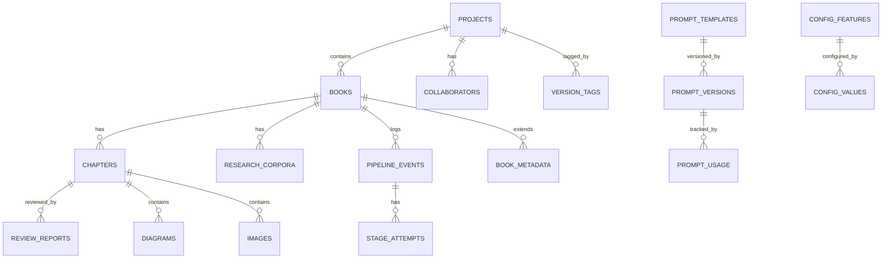
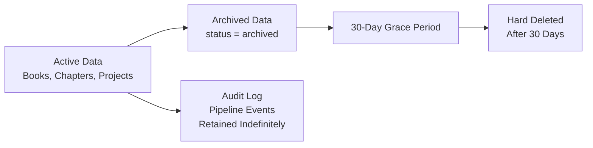
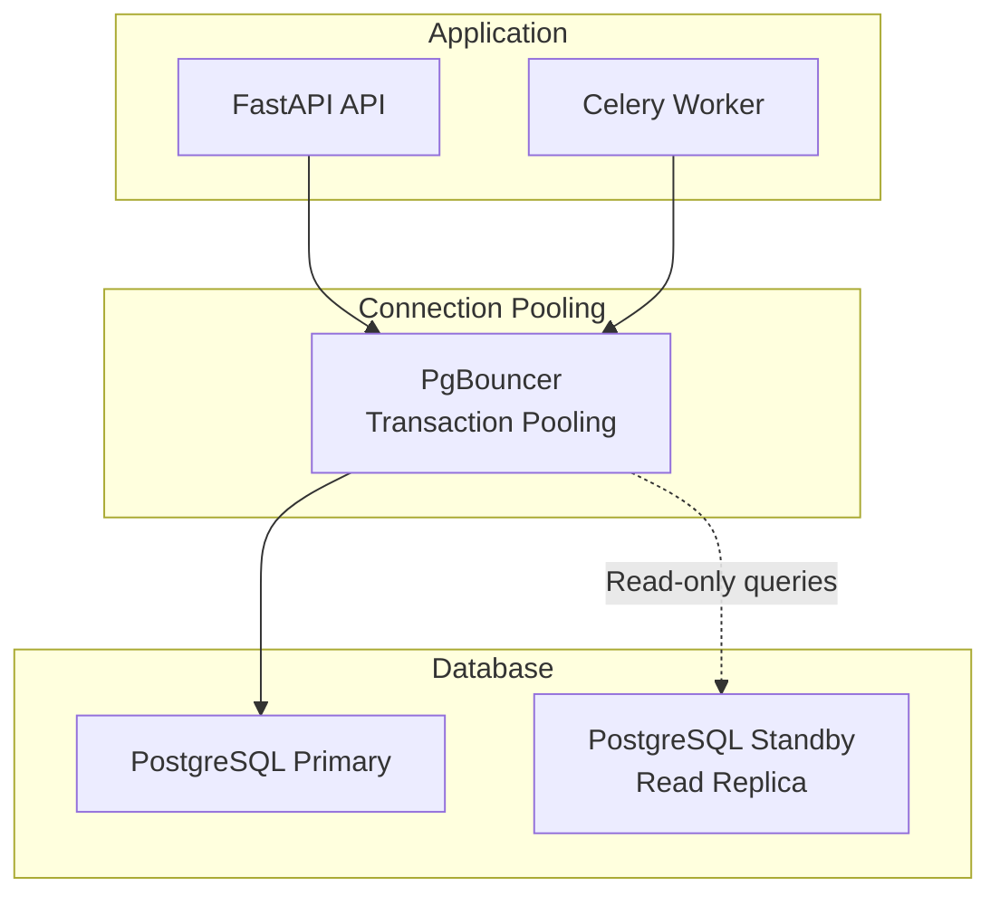

# Database

> Database schema, entity relationships, and data persistence architecture.

---

## Table of Contents

- [Design Philosophy](#design-philosophy)
- [Entity Relationship Diagram](#entity-relationship-diagram)
- [Table Catalog](#table-catalog)
- [Table Definitions](#table-definitions)
- [Index Strategy](#index-strategy)
- [Migration Strategy](#migration-strategy)
- [Data Lifecycle](#data-lifecycle)
- [Connection Architecture](#connection-architecture)

---

## Design Philosophy

| Principle | Rationale |
|---|---|
| **PostgreSQL as source of truth** | The database owns all persistent state. Redis is a cache — data in Redis can be regenerated from the database. |
| **JSONB for flexible schemas** | Book specifications, research corpora, and review findings have variable structures. JSONB provides schema flexibility without sacrificing queryability. |
| **UUIDv7 primary keys** | Time-ordered UUIDs enable cursor-based pagination, avoid sequential ID guessing, and are globally unique across distributed deployments. |
| **Immutable audit events** | The `pipeline_events` table is append-only. Events are never updated or deleted — they form an immutable audit log. |
| **Soft deletes** | Records are archived, not deleted. A 30-day grace period before hard deletion enables recovery from accidental removal. |

---

## Entity Relationship Diagram



### Relationship Summary

| Parent | Child | Cardinality | Foreign Key |
|---|---|---|---|
| `projects` | `books` | 1:N | `book.project_id` |
| `books` | `chapters` | 1:N | `chapter.book_id` |
| `books` | `research_corpora` | 1:N | `research_corpus.book_id` |
| `books` | `pipeline_events` | 1:N | `pipeline_event.book_id` |
| `books` | `book_metadata` | 1:1 | `book_metadata.book_id` |
| `chapters` | `review_reports` | 1:N | `review_report.chapter_id` |
| `chapters` | `diagrams` | 1:N | `diagram.chapter_id` |
| `chapters` | `images` | 1:N | `image.chapter_id` |
| `projects` | `collaborators` | 1:N | `collaborator.project_id` |
| `projects` | `version_tags` | 1:N | `version_tag.project_id` |
| `prompt_templates` | `prompt_versions` | 1:N | `prompt_version.template_id` |
| `prompt_versions` | `prompt_usage` | 1:N | `prompt_usage.version_id` |
| `pipeline_events` | `stage_attempts` | 1:N | `stage_attempt.event_id` |

---

## Table Catalog

| # | Table | Purpose | Volume Estimate |
|---|---|---|---|
| 1 | `projects` | Project container with collaboration settings | 10K |
| 2 | `books` | Core book entity and pipeline state | 50K |
| 3 | `chapters` | Chapter content in markdown | 500K |
| 4 | `research_corpora` | Research data per book | 50K |
| 5 | `book_metadata` | Extended metadata key-value store | 50K |
| 6 | `review_reports` | Review findings per chapter | 2M |
| 7 | `diagrams` | Diagram definitions and assets | 500K |
| 8 | `images` | Image metadata and references | 500K |
| 9 | `collaborators` | Project-role assignments | 100K |
| 10 | `version_tags` | Project version history | 100K |
| 11 | `prompt_templates` | Prompt template definitions | 1K |
| 12 | `prompt_versions` | Versioned template content | 10K |
| 13 | `prompt_usage` | Track which version generated what | 10M |
| 14 | `pipeline_events` | Immutable pipeline audit log | 10M |
| 15 | `stage_attempts` | Individual retry attempts per stage | 20M |
| 16 | `config_features` | Feature flag definitions | 100 |
| 17 | `config_values` | Feature flag values per environment | 500 |

---

## Table Definitions

### `projects`

```sql
CREATE TABLE projects (
    id              UUID PRIMARY KEY DEFAULT gen_random_uuid(),
    name            VARCHAR(255) NOT NULL,
    description     TEXT,
    settings        JSONB DEFAULT '{}',
    status          VARCHAR(50) DEFAULT 'active',
    created_at      TIMESTAMPTZ NOT NULL DEFAULT now(),
    updated_at      TIMESTAMPTZ NOT NULL DEFAULT now()
);
```

**Why?** A project groups books and collaborators. Without it, every book would need its own collaborator management and every user would need book-level permissions.

### `books`

```sql
CREATE TABLE books (
    id              UUID PRIMARY KEY DEFAULT gen_random_uuid(),
    project_id      UUID NOT NULL REFERENCES projects(id),
    title           VARCHAR(255) NOT NULL,
    topic           VARCHAR(100) NOT NULL,
    audience        VARCHAR(50) NOT NULL,
    target_chapters INTEGER DEFAULT 10,
    target_pages    INTEGER DEFAULT 200,
    status          VARCHAR(50) DEFAULT 'draft',
    specification   JSONB NOT NULL,
    pipeline_id     UUID,
    current_stage   VARCHAR(100),
    output_refs     JSONB DEFAULT '{}',
    created_at      TIMESTAMPTZ NOT NULL DEFAULT now(),
    updated_at      TIMESTAMPTZ NOT NULL DEFAULT now(),
    archived_at     TIMESTAMPTZ
);
```

**Indexes:** `(project_id)`, `(status)`, `(topic)`, `(created_at DESC)`

### `chapters`

```sql
CREATE TABLE chapters (
    id              UUID PRIMARY KEY DEFAULT gen_random_uuid(),
    book_id         UUID NOT NULL REFERENCES books(id),
    number          INTEGER NOT NULL,
    title           VARCHAR(255) NOT NULL,
    content         TEXT,
    word_count      INTEGER DEFAULT 0,
    status          VARCHAR(50) DEFAULT 'pending',
    revision_cycle  INTEGER DEFAULT 0,
    diagram_refs    JSONB DEFAULT '[]',
    image_refs      JSONB DEFAULT '[]',
    created_at      TIMESTAMPTZ NOT NULL DEFAULT now(),
    updated_at      TIMESTAMPTZ NOT NULL DEFAULT now(),
    UNIQUE(book_id, number)
);
```

**Why unique on `(book_id, number)`?** Prevents two chapters from having the same number within a book. Chapter reordering changes numbers explicitly.

### `research_corpora`

```sql
CREATE TABLE research_corpora (
    id              UUID PRIMARY KEY DEFAULT gen_random_uuid(),
    book_id         UUID NOT NULL REFERENCES books(id),
    chapter_number  INTEGER,
    sources         JSONB DEFAULT '[]',
    summary         TEXT,
    key_concepts    JSONB DEFAULT '[]',
    prerequisites   JSONB DEFAULT '[]',
    learning_objectives JSONB DEFAULT '[]',
    created_at      TIMESTAMPTZ NOT NULL DEFAULT now(),
    UNIQUE(book_id, chapter_number)
);
```

### `book_metadata`

```sql
CREATE TABLE book_metadata (
    id              UUID PRIMARY KEY DEFAULT gen_random_uuid(),
    book_id         UUID NOT NULL UNIQUE REFERENCES books(id),
    style_guide     VARCHAR(100),
    language        VARCHAR(10) DEFAULT 'en',
    cover_image_ref VARCHAR(500),
    generation_stats JSONB DEFAULT '{}',
    custom_settings JSONB DEFAULT '{}',
    created_at      TIMESTAMPTZ NOT NULL DEFAULT now(),
    updated_at      TIMESTAMPTZ NOT NULL DEFAULT now()
);
```

**Why a separate table instead of a JSONB column on `books`?** Metadata has a different access pattern — it is read less frequently and updated independently from the book record. Separating it reduces lock contention on the `books` table.

### `review_reports`

```sql
CREATE TABLE review_reports (
    id              UUID PRIMARY KEY DEFAULT gen_random_uuid(),
    chapter_id      UUID NOT NULL REFERENCES chapters(id),
    stage           VARCHAR(50) NOT NULL,
    verdict         VARCHAR(20) NOT NULL,
    findings        JSONB DEFAULT '[]',
    score           DECIMAL(3,2),
    revision_cycle  INTEGER NOT NULL,
    created_at      TIMESTAMPTZ NOT NULL DEFAULT now(),
    CHECK (verdict IN ('pass', 'fail', 'pending'))
);
```

### `diagrams`

```sql
CREATE TABLE diagrams (
    id              UUID PRIMARY KEY DEFAULT gen_random_uuid(),
    chapter_id      UUID NOT NULL REFERENCES chapters(id),
    diagram_type    VARCHAR(50) NOT NULL,
    description     TEXT,
    source          TEXT NOT NULL,
    format          VARCHAR(20) NOT NULL DEFAULT 'mermaid',
    asset_ref       VARCHAR(500),
    insertion_point INTEGER,
    created_at      TIMESTAMPTZ NOT NULL DEFAULT now()
);
```

### `images`

```sql
CREATE TABLE images (
    id              UUID PRIMARY KEY DEFAULT gen_random_uuid(),
    chapter_id      UUID REFERENCES chapters(id),
    image_type      VARCHAR(50) NOT NULL,
    asset_ref       VARCHAR(500) NOT NULL,
    caption         TEXT,
    width_px        INTEGER,
    height_px       INTEGER,
    file_size_bytes INTEGER,
    created_at      TIMESTAMPTZ NOT NULL DEFAULT now()
);
```

**Why separate `images` from `diagrams`?** They have different generation methods (LLM vs image model), different storage characteristics, and different metadata. Combining them would create a table with many nullable columns.

### `collaborators`

```sql
CREATE TABLE collaborators (
    id              UUID PRIMARY KEY DEFAULT gen_random_uuid(),
    project_id      UUID NOT NULL REFERENCES projects(id),
    user_email      VARCHAR(255) NOT NULL,
    role            VARCHAR(50) NOT NULL,
    invited_at      TIMESTAMPTZ NOT NULL DEFAULT now(),
    accepted_at     TIMESTAMPTZ,
    UNIQUE(project_id, user_email)
);
```

### `version_tags`

```sql
CREATE TABLE version_tags (
    id              UUID PRIMARY KEY DEFAULT gen_random_uuid(),
    project_id      UUID NOT NULL REFERENCES projects(id),
    tag             VARCHAR(100) NOT NULL,
    description     TEXT,
    snapshot        JSONB NOT NULL,
    created_at      TIMESTAMPTZ NOT NULL DEFAULT now(),
    UNIQUE(project_id, tag)
);
```

**Why store a `snapshot`?** A version tag captures the state of all books in the project at a point in time. The snapshot allows reproducing the exact build that produced a given PDF, even if the underlying content has changed.

### `prompt_templates`

```sql
CREATE TABLE prompt_templates (
    id              UUID PRIMARY KEY DEFAULT gen_random_uuid(),
    name            VARCHAR(100) NOT NULL UNIQUE,
    description     TEXT,
    created_at      TIMESTAMPTZ NOT NULL DEFAULT now()
);
```

### `prompt_versions`

```sql
CREATE TABLE prompt_versions (
    id              UUID PRIMARY KEY DEFAULT gen_random_uuid(),
    template_id     UUID NOT NULL REFERENCES prompt_templates(id),
    version         VARCHAR(20) NOT NULL,
    template        TEXT NOT NULL,
    variables       JSONB DEFAULT '{}',
    changelog       TEXT,
    created_at      TIMESTAMPTZ NOT NULL DEFAULT now(),
    UNIQUE(template_id, version)
);
```

### `prompt_usage`

```sql
CREATE TABLE prompt_usage (
    id              UUID PRIMARY KEY DEFAULT gen_random_uuid(),
    version_id      UUID NOT NULL REFERENCES prompt_versions(id),
    book_id         UUID NOT NULL REFERENCES books(id),
    chapter_id      UUID REFERENCES chapters(id),
    input_tokens    INTEGER,
    output_tokens   INTEGER,
    duration_ms     INTEGER,
    created_at      TIMESTAMPTZ NOT NULL DEFAULT now()
);
```

**Why track prompt usage?** Enables auditing which prompt version generated which content. Critical for debugging, A/B testing, and reproducing issues.

### `pipeline_events`

```sql
CREATE TABLE pipeline_events (
    id              UUID PRIMARY KEY DEFAULT gen_random_uuid(),
    book_id         UUID NOT NULL REFERENCES books(id),
    stage           VARCHAR(100) NOT NULL,
    event_type      VARCHAR(50) NOT NULL,
    status          VARCHAR(50) NOT NULL,
    context         JSONB DEFAULT '{}',
    created_at      TIMESTAMPTZ NOT NULL DEFAULT now()
);
```

**Immutable:** This table is append-only. No UPDATE, no DELETE. A complete history of every pipeline transition.

### `stage_attempts`

```sql
CREATE TABLE stage_attempts (
    id              UUID PRIMARY KEY DEFAULT gen_random_uuid(),
    event_id        UUID NOT NULL REFERENCES pipeline_events(id),
    attempt_number  INTEGER NOT NULL,
    status          VARCHAR(20) NOT NULL,
    error           TEXT,
    duration_ms     INTEGER,
    created_at      TIMESTAMPTZ NOT NULL DEFAULT now()
);
```

### `config_features`

```sql
CREATE TABLE config_features (
    id              UUID PRIMARY KEY DEFAULT gen_random_uuid(),
    name            VARCHAR(100) NOT NULL UNIQUE,
    description     TEXT,
    default_value   BOOLEAN NOT NULL DEFAULT false,
    created_at      TIMESTAMPTZ NOT NULL DEFAULT now()
);
```

### `config_values`

```sql
CREATE TABLE config_values (
    id              UUID PRIMARY KEY DEFAULT gen_random_uuid(),
    feature_id      UUID NOT NULL REFERENCES config_features(id),
    environment     VARCHAR(50) NOT NULL,
    value           BOOLEAN NOT NULL,
    UNIQUE(feature_id, environment)
);
```

---

## Index Strategy

| Table | Index | Type | Rationale |
|---|---|---|---|
| `books` | `(project_id)` | B-tree | Find all books in a project |
| `books` | `(status)` | B-tree | Filter by pipeline state |
| `books` | `(topic)` | B-tree | Filter by technical domain |
| `books` | `(created_at DESC)` | B-tree | Order by recency for listing |
| `chapters` | `(book_id, number)` | Unique B-tree | Ordered chapter retrieval |
| `chapters` | `(status)` | B-tree | Find pending/review chapters |
| `research_corpora` | `(book_id, chapter_number)` | Unique B-tree | Research lookup per chapter |
| `review_reports` | `(chapter_id, stage)` | B-tree | Review findings per stage |
| `review_reports` | `(verdict)` | B-tree | Find failing chapters |
| `pipeline_events` | `(book_id, created_at DESC)` | B-tree | Load pipeline timeline |
| `prompt_usage` | `(book_id)` | B-tree | Track which prompts generated a book |
| `prompt_usage` | `(version_id)` | B-tree | Track where a prompt version was used |
| `config_features` | `(name)` | Unique B-tree | Feature lookup by name |

---

## Migration Strategy

| Tool | Alembic |
|---|---|
| Naming | `YYYYMMDD_HHMM_description.py` |
| Policy | Every migration is reversible (`upgrade` + `downgrade`) |
| Review | Migrations are reviewed as part of PR process |
| Automation | Applied on worker startup in development; manual in production |
| Seed data | Managed via Alembic data migrations (templates, default config) |

---

## Data Lifecycle



**Archival policy:** Books are soft-deleted (archived) when a user deletes them. After 30 days, a background job hard-deletes archived books and their associated chapters, research corpus, and metadata. Pipeline events and prompt usage records are retained indefinitely for audit purposes.

---

## Connection Architecture



**Why PgBouncer?** FastAPI and Celery both use connection pools. Without PgBouncer, every worker process holds a database connection, exhausting PostgreSQL's connection limit. PgBouncer multiplexes application connections into a smaller pool of database connections.

**Read replicas:** Read-only queries (book listing, status polling) are routed to a read replica. Write queries (chapter persistence, event logging) go to the primary. This separates read load from write load.
