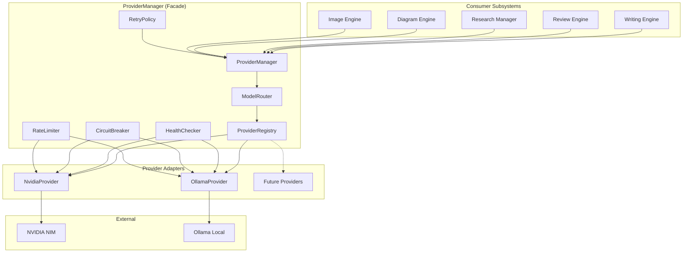

# LLM Integration

> Provider abstraction and configuration — implemented in ``packages/llm/``.

---

## Implementation

The Provider Manager is implemented as a standalone Python package at
``packages/llm/``. See ``packages/llm/README.md`` for the full reference.

## Provider Architecture



## Routing Strategy

```
Request → ProviderManager.chat()
  → ModelRouter.route(Capability.CHAT)
    → Check primary (nvidia) circuit breaker: CLOSED?
      → NO → try fallback (ollama)
    → Check primary health: HEALTHY?
      → NO → try fallback (ollama)
    → Return primary provider adapter
  → Enforce rate limit (token bucket)
  → Execute with_retry(provider.chat)
    → Retry on ProviderTimeout, RateLimitError, ProviderError
    → Exponential backoff 2^N + 25% jitter
    → Max 3 retries
  → On success → record_success (close circuit)
  → On failure after retries → record_failure → open circuit
  → If fallback enabled → retry on fallback provider
```

## Error Handling

| Error | Raised When | Retryable |
|---|---|---|
| `ProviderUnavailable` | Provider unreachable or unhealthy | Yes |
| `AuthenticationError` | API key invalid or missing | No |
| `RateLimitError` | Rate limit exceeded | Yes |
| `ProviderTimeout` | Request exceeded timeout | Yes |
| `ConfigurationError` | Invalid configuration | No |
| `InvalidProvider` | Provider not registered | No |

## Configuration

```env
LLM_PROVIDER=nvidia
LLM_FALLBACK_PROVIDER=ollama
LLM_DEFAULT_MODEL=meta/llama-3.1-70b-instruct
LLM_MAX_RETRIES=3
LLM_RATE_LIMIT_REQUESTS_PER_MINUTE=60
LLM_CIRCUIT_BREAKER_THRESHOLD=5
NVIDIA_NIM_API_KEY=
NVIDIA_NIM_BASE_URL=http://nim.example.com:8000
NVIDIA_NIM_MODEL=meta/llama-3.1-70b-instruct
OLLAMA_BASE_URL=http://localhost:11434
OLLAMA_MODEL=llama3.1
```

## Pluggability

New providers implement ``LLMProvider`` and register via ``ProviderRegistry.register()``:

```python
from bookforge.llm import LLMProvider, ProviderManager

class MyProvider(LLMProvider):
    @property
    def name(self) -> str: return "my-provider"
    # ... implement all methods

manager = ProviderManager.from_env()
manager.register_provider(MyProvider(config))
```
