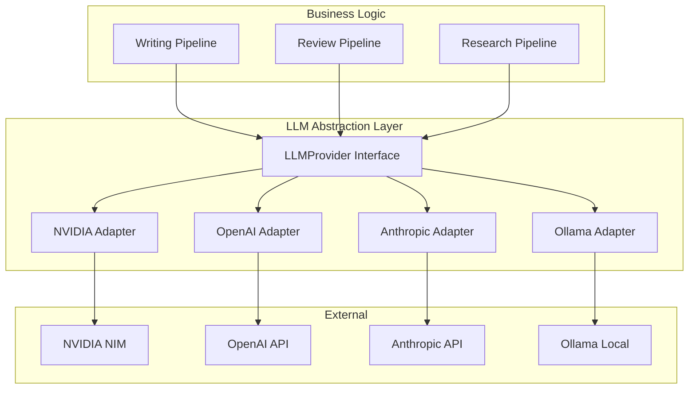

# LLM Integration

> LLM provider abstraction layer, configuration, and usage.

---

## Table of Contents

- [Overview](#overview)
- [Provider Abstraction](#provider-abstraction)
- [Supported Providers](#supported-providers)
- [Configuration](#configuration)
- [Usage Patterns](#usage-patterns)
- [Rate Limiting and Retries](#rate-limiting-and-retries)

---

## Overview

BookForge AI supports multiple LLM providers through a unified abstraction layer in the `llm` package. This design decouples content generation logic from provider-specific implementation details, enabling provider switching, fallback, and A/B testing without touching business logic.



---

## Provider Abstraction

### Interface

Every provider adapter implements:

```python
class LLMProvider(ABC):
    async def generate(
        self,
        messages: list[Message],
        config: LLMConfig
    ) -> LLMResponse: ...

    async def generate_stream(
        self,
        messages: list[Message],
        config: LLMConfig
    ) -> AsyncIterator[LLMChunk]: ...

    async def embed(
        self,
        texts: list[str]
    ) -> list[Embedding]: ...

    async def health(self) -> HealthStatus: ...
```

### Normalisation

All provider responses are normalised to a common `LLMResponse` type:

| Field | Description |
|---|---|
| `content` | Generated text content |
| `finish_reason` | stop, length, content_filter, error |
| `usage` | Token usage (prompt, completion, total) |
| `model` | Model identifier used |
| `latency_ms` | Response time in milliseconds |

---

## Supported Providers

| Provider | Support | Use Case |
|---|---|---|
| **NVIDIA NIM** | Full | Enterprise, self-hosted, GPU-backed |
| **OpenAI** | Full | General purpose, GPT-4o, GPT-4-turbo |
| **Anthropic** | Full | Long-form content, Claude Opus/Sonnet |
| **Ollama** | Full | Local development, offline use, small models |

---

## Configuration

Providers are configured via environment variables:

```env
# Default provider selection
LLM_DEFAULT_PROVIDER=nvidia

# NVIDIA NIM
NVIDIA_NIM_API_KEY=
NVIDIA_NIM_BASE_URL=http://nim.example.com:8000
NVIDIA_NIM_MODEL=meta/llama-3.1-70b-instruct

# OpenAI
OPENAI_API_KEY=
OPENAI_MODEL=gpt-4o

# Anthropic
ANTHROPIC_API_KEY=
ANTHROPIC_MODEL=claude-sonnet-4-20250514

# Ollama
OLLAMA_BASE_URL=http://localhost:11434
OLLAMA_MODEL=llama3.1
```

---

## Usage Patterns

### Direct Generation

```python
provider = get_provider("openai")
response = await provider.generate(
    messages=[Message(role="user", content="Write a chapter about...")],
    config=LLMConfig(temperature=0.7, max_tokens=4096)
)
```

### Streaming

```python
async for chunk in provider.generate_stream(messages, config):
    buffer += chunk.content
```

### Provider Fallback

```python
providers = [get_provider("nvidia"), get_provider("openai")]
for provider in providers:
    try:
        return await provider.generate(messages, config)
    except ProviderError:
        continue
```

---

## Rate Limiting and Retries

### Configuration

```env
LLM_MAX_RETRIES=3
LLM_RETRY_BACKOFF_FACTOR=2.0
LLM_RATE_LIMIT_REQUESTS_PER_MINUTE=60
LLM_RATE_LIMIT_TOKENS_PER_MINUTE=100000
```

### Behaviour

- **Rate limiting** is enforced per-provider using a token bucket algorithm
- **Retries** use exponential backoff with jitter
- **Circuit breaker** trips after 5 consecutive failures for a provider
- **Fallback** automatically routes to the next available provider when the primary is unavailable
