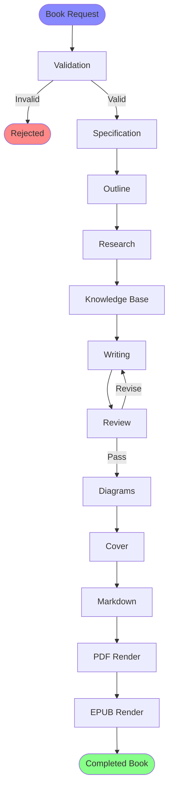
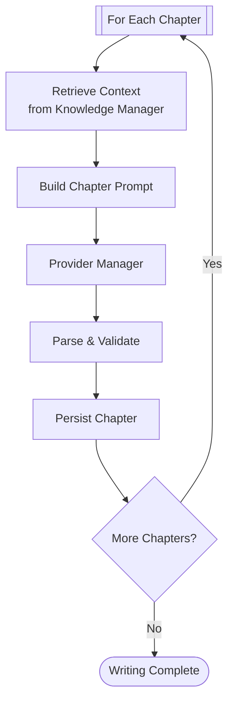
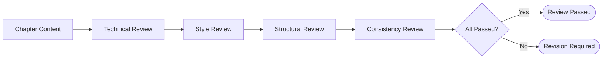
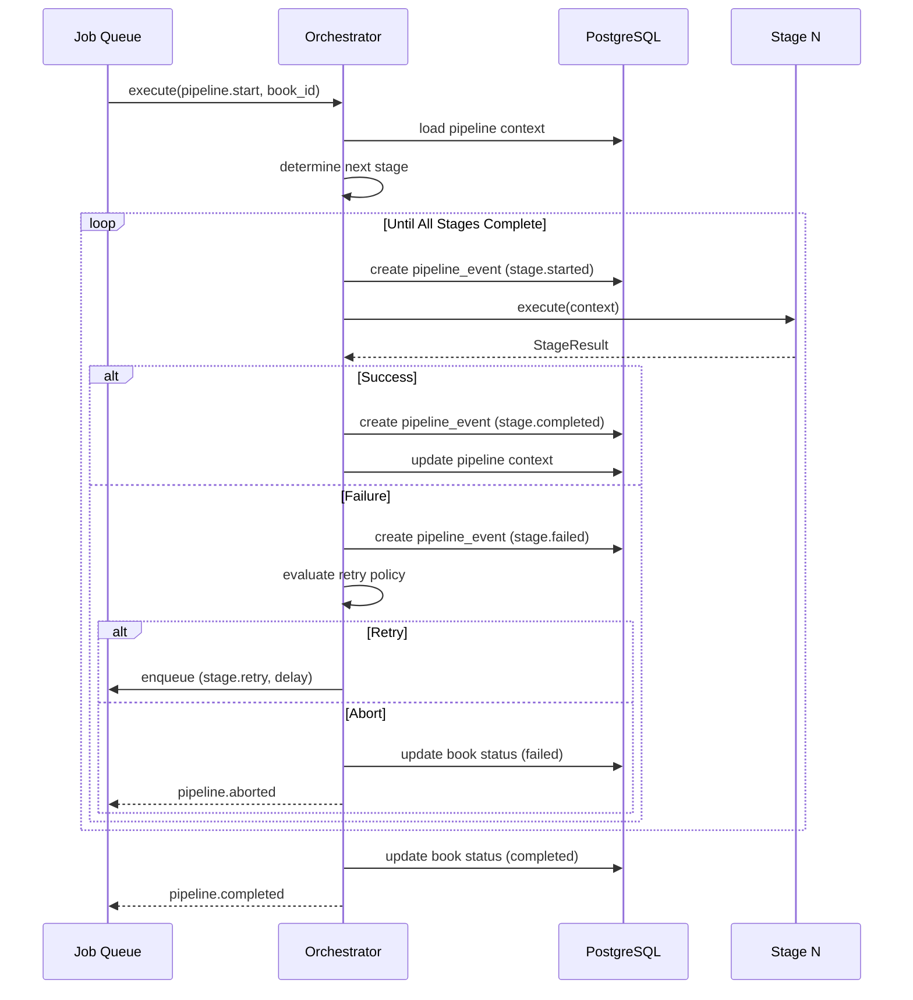
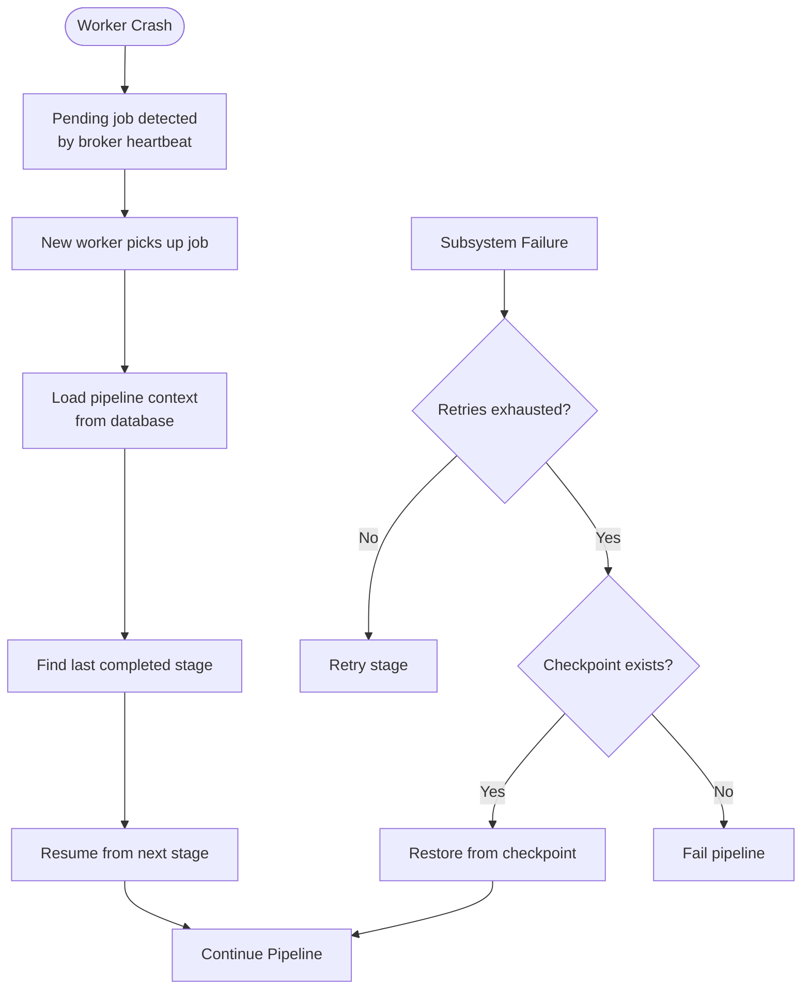

# Pipeline

> Complete book generation pipeline — every stage, every transition, every output.

---

## Table of Contents

- [Pipeline Overview](#pipeline-overview)
- [Stage Catalog](#stage-catalog)
- [Stage Details](#stage-details)
- [Pipeline Orchestration](#pipeline-orchestration)
- [Pipeline Configuration](#pipeline-configuration)
- [Pipeline Recovery](#pipeline-recovery)
- [Pipeline Events](#pipeline-events)

---

## Pipeline Overview



The pipeline has **13 stages** organised into **4 phases**:

| Phase | Stages | Description |
|---|---|---|
| **Definition** | Validation, Specification | Accept and validate the book request |
| **Preparation** | Outline, Research, Knowledge Base | Gather intelligence |
| **Creation** | Writing, Review, Diagrams, Cover | Generate content |
| **Production** | Markdown, PDF, EPUB | Produce output formats |

---

## Stage Catalog

| # | Stage | Input | Output | Subsystem | Duration |
|---|---|---|---|---|---|
| 1 | Validation | Book request | Validation result | Book Manager | <1s |
| 2 | Specification | Validated request | Book spec | Project Manager | <1s |
| 3 | Outline | Book spec | Chapter outline | Outline Engine | 10–60s |
| 4 | Research | Book spec + outline | Research corpus | Research Manager | 30–300s |
| 5 | Knowledge Base | Research corpus | Embeddings + context | Knowledge Manager | 10–60s |
| 6 | Writing | Outline + context | Chapter content | Writing Engine | 60–600s |
| 7 | Review | Chapter content | Review report | Review Engine | 30–180s |
| 8 | Diagrams | Chapter content | Diagram definitions | Diagram Engine | 10–120s |
| 9 | Cover | Book metadata | Cover image | Image Engine | 10–60s |
| 10 | Markdown | Chapters + diagrams + cover | Formatted markdown | Markdown Engine | 1–10s |
| 11 | PDF | Formatted markdown | PDF file | Publishing Engine | 10–120s |
| 12 | EPUB | Formatted markdown | EPUB file | Publishing Engine | 10–60s |

---

## Stage Details

### Stage 1: Validation

**Subsystem:** Book Manager

**Purpose:** Validate the book request against business rules.

| Check | Failure Action |
|---|---|
| Topic is in supported list | Reject with 422 |
| Title is non-empty | Reject with 422 |
| Target audience is valid | Reject with 422 |
| Chapter count is within limits | Clamp to limits |
| Specification JSON is well-formed | Reject with 422 |

**Output:** A validated `BookSpec` object with guaranteed fields.

---

### Stage 2: Specification

**Subsystem:** Project Manager

**Purpose:** Create the full book specification from the validated request. Enriches the request with defaults, assigns a book ID, and initialises the project container.

| Enrichment | Source |
|---|---|
| Default style guide | Configuration |
| Default language (en) | Configuration |
| Version tag (1.0.0) | Auto-generated |
| Book ID (UUIDv7) | Auto-generated |

**Output:** A complete `BookSpecification` persisted to the database.

---

### Stage 3: Outline

**Subsystem:** Outline Engine

**Purpose:** Generate a structured chapter-by-chapter outline.

**Process:**

1. Load the book specification from the database
2. Build a prompt from the Prompt Manager using the `outline-generator` template
3. Send the prompt to the Provider Manager
4. Parse the LLM response into a structured outline
5. Validate the outline (minimum/maximum chapters, no duplicate titles)
6. Persist the outline as chapter records in the database

**Output:** A list of chapter definitions stored in the `chapters` table.


---

### Stage 4: Research

**Subsystem:** Research Manager

**Purpose:** Gather and synthesise technical research for the book topic.

**Process:**

1. For each chapter in the outline, build a research prompt
2. Query the Provider Manager for structured research
3. Extract key concepts, definitions, and learning objectives
4. Cross-reference concepts across chapters
5. Persist the research corpus

**Output:** A `ResearchCorpus` containing sources, concepts, and summaries.

---

### Stage 5: Knowledge Base

**Subsystem:** Knowledge Manager

**Purpose:** Convert the research corpus into searchable embeddings stored in the vector index.

**Process:**

1. Chunk the research corpus into segments
2. Generate embeddings for each segment via the Provider Manager
3. Store embeddings in the vector index (Redis)
4. Build a context retrieval index for the writing stage

**Output:** A populated vector index ready for similarity search.

---

### Stage 6: Writing

**Subsystem:** Writing Engine

**Purpose:** Generate chapter content for every chapter in the outline.

**Process:**



**Context retrieval:** Before writing each chapter, the Writing Engine queries the Knowledge Manager for:
- Related content from previous chapters (for cross-references)
- Key concepts from the research corpus
- Prerequisite knowledge the reader should have

**Prompt strategy:**
- Chapter prompt includes: title, section outline, context snippets, style guide, target audience
- Each section within a chapter is generated sequentially to maintain flow
- Code examples are generated inline with prose

**Output:** Complete chapter content in markdown, persisted to the `chapters` table.

---

### Stage 7: Review

**Subsystem:** Review Engine

**Purpose:** Run quality checks on generated content. Supports multiple review stages.



| Review Stage | What It Checks | LLM Prompt Template |
|---|---|---|
| Technical | Factual accuracy, code correctness, claims | `technical-review` |
| Style | Tone, terminology, formatting consistency | `style-review` |
| Structural | Logical flow, section ordering, completeness | `structural-review` |
| Consistency | Terminology consistency across all chapters | `consistency-review` |

**Revision loop:**
- If a review fails, the findings are appended to the chapter prompt
- The Writing Engine regenerates the affected sections
- The Review Engine re-checks only the modified sections
- A maximum of 3 revision cycles is enforced to prevent infinite loops

**Output:** A `ReviewReport` per chapter with pass/fail verdicts and findings.

---

### Stage 8: Diagrams

**Subsystem:** Diagram Engine

**Purpose:** Generate architecture diagrams and flowcharts from content descriptions.

**Process:**

1. Scan chapter content for diagram insertion points (marked during writing)
2. For each insertion point, build a diagram description prompt
3. Send the prompt to the Provider Manager
4. Parse the response into Mermaid or PlantUML source
5. Render the diagram and store the image asset
6. Embed the diagram reference in the chapter markdown

**Supported diagram types:** flowchart, sequence diagram, class diagram, ERD, component diagram, state diagram, Gantt chart

**Output:** Diagram definitions and rendered image assets.

---

### Stage 9: Cover

**Subsystem:** Image Engine

**Purpose:** Generate the book cover image.

**Process:**

1. Extract book metadata (title, subtitle, topic, audience)
2. Build a cover design prompt
3. Send the prompt to the Provider Manager (image-capable model)
4. Process the generated image (resize, crop, optimise)
5. Store the cover image as an asset

**Output:** A cover image file ready for embedding in the PDF.

---

### Stage 10: Markdown

**Subsystem:** Markdown Engine

**Purpose:** Assemble and format the complete book as a single publication-ready markdown document.

**Process:**

1. Load all chapters in order from the database
2. Load diagram references and embed diagram source blocks
3. Load cover reference
4. Generate table of contents from chapter headings
5. Normalise heading hierarchy (single H1, sequential H2/H3)
6. Format code blocks with consistent syntax annotations
7. Validate cross-references and internal links
8. Apply typographic conventions (curly quotes, em dashes, spacing)
9. Produce the final markdown document

**Output:** A single markdown string containing the complete formatted book.

---

### Stage 11: PDF

**Subsystem:** Publishing Engine

**Purpose:** Compile the formatted markdown into a publication-ready PDF.

**Process:**

1. Load the formatted markdown
2. Apply PDF styling (fonts, margins, headers, footers)
3. Render the cover page
4. Generate the table of contents with page numbers
5. Render diagrams and images inline
6. Generate PDF bookmarks for navigation
7. Produce the final PDF binary

**Output:** A PDF file stored in object storage.

---

### Stage 12: EPUB

**Subsystem:** Publishing Engine

**Purpose:** Compile the formatted markdown into an EPUB ebook.

**Process:**

1. Load the formatted markdown
2. Generate EPUB metadata (title, author, ISBN placeholder)
3. Apply EPUB styling (CSS, fonts)
4. Generate the EPUB spine and table of contents
5. Render diagrams and images inline
6. Produce the final EPUB binary

**Output:** An EPUB file stored in object storage.

---

## Pipeline Orchestration



---

## Pipeline Configuration

Pipeline behaviour is configured via `config/pipeline.yaml`:

```yaml
pipeline:
  max_revision_cycles: 3
  checkpoint_enabled: true

  stages:
    outline:
      timeout_seconds: 120
      retry_count: 2
    research:
      timeout_seconds: 600
      retry_count: 3
    writing:
      timeout_seconds: 3600
      retry_count: 3
      chapter_concurrency: 1
    review:
      timeout_seconds: 300
      retry_count: 2
    diagrams:
      timeout_seconds: 300
      retry_count: 2
    markdown:
      timeout_seconds: 60
      retry_count: 1
    pdf:
      timeout_seconds: 300
      retry_count: 2
    epub:
      timeout_seconds: 180
      retry_count: 2
```

---

## Pipeline Recovery



**Key decisions:**

| Decision | Rationale |
|---|---|
| Checkpoint after every stage | Enables granular resume. Losing one stage of work is acceptable. Losing all work is not. |
| Pipeline context in PostgreSQL | The database is the source of truth. Redis is fast but ephemeral. A Redis flush should not lose pipeline state. |
| At-least-once execution | A stage may execute more than once after a crash. Stages must be idempotent — running them twice produces the same result as running them once. |
| Configurable timeouts | Different stages have different latency profiles. Writing a chapter takes longer than rendering a diagram. Per-stage timeouts prevent slow stages from blocking fast ones. |

---

## Pipeline Events

Every stage transition emits a structured event:

| Event | Payload | Emitted By |
|---|---|---|
| `pipeline.stage.started` | `{book_id, stage, timestamp}` | Orchestrator |
| `pipeline.stage.completed` | `{book_id, stage, output_ref, duration_ms}` | Orchestrator |
| `pipeline.stage.failed` | `{book_id, stage, error, retry_count}` | Orchestrator |
| `pipeline.stage.retrying` | `{book_id, stage, attempt, delay}` | Orchestrator |
| `pipeline.completed` | `{book_id, output_refs, total_duration_ms}` | Orchestrator |
| `pipeline.aborted` | `{book_id, stage, error}` | Orchestrator |

Events are persisted in the `pipeline_events` table and forwarded to the logging system for monitoring and alerting.
