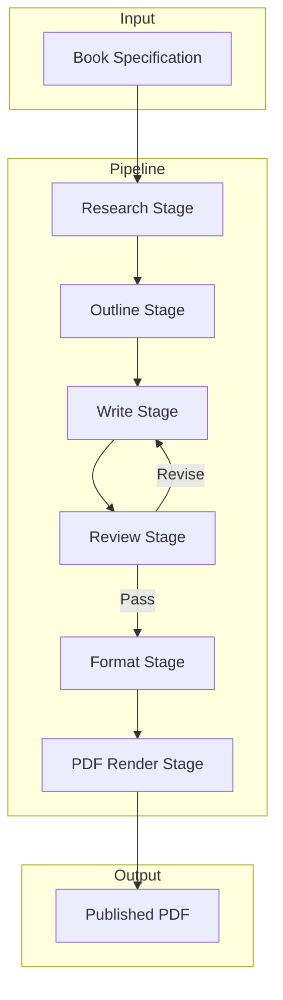
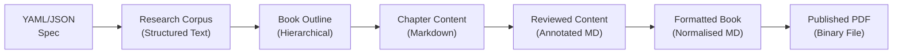
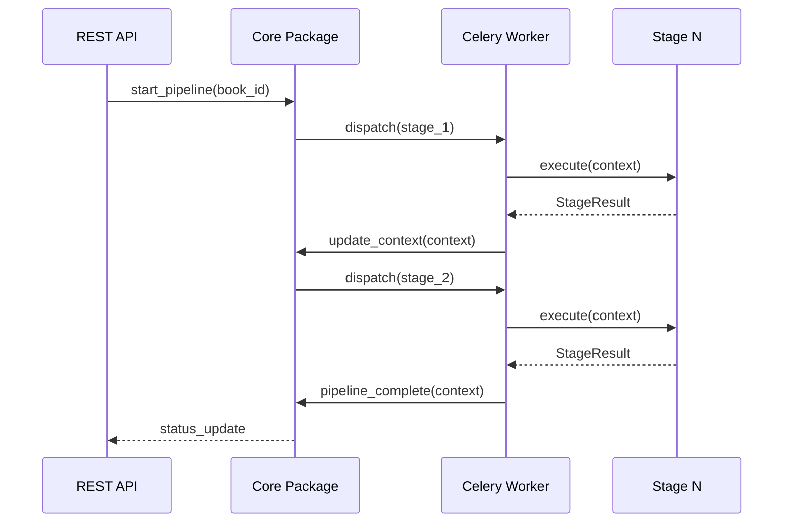

# Pipeline

> Data pipeline architecture, transformations, and orchestration.

---

## Table of Contents

- [Overview](#overview)
- [Pipeline Architecture](#pipeline-architecture)
- [Data Transformations](#data-transformations)
- [Pipeline Orchestration](#pipeline-orchestration)
- [Error Handling](#error-handling)

---

## Overview

The BookForge AI pipeline transforms a book specification into a published PDF through a series of discrete stages. Each stage receives input data, applies a transformation, and passes the result to the next stage.



---

## Pipeline Architecture

### Stage Interface

Every pipeline stage implements a common interface:

| Component | Description |
|---|---|
| `StageInput` | Typed input data for the stage |
| `StageOutput` | Typed output data produced by the stage |
| `execute(input)` | Core transformation logic |
| `validate(output)` | Post-condition validation |
| `rollback(context)` | Cleanup logic on failure |

### Pipeline Context

A shared context object flows through all stages:

```python
PipelineContext:
    book_id: UUID
    specification: BookSpec
    research: ResearchCorpus | None
    outline: BookOutline | None
    chapters: list[Chapter] | None
    review_results: ReviewReport | None
    formatted_markdown: str | None
    pdf_path: Path | None
    metadata: dict
    errors: list[PipelineError]
```

---

## Data Transformations



| Transformation | From | To | Package |
|---|---|---|---|
| Topic research | Book specification | Research corpus | `research` |
| Outline generation | Research corpus | Chapter outline | `research` |
| Content generation | Chapter outline | Chapter markdown | `llm` + `prompts` |
| Review annotation | Chapter markdown | Annotated markdown | `review` |
| Content revision | Annotated markdown | Revised markdown | `llm` + `prompts` |
| Markdown formatting | Raw markdown | Normalised markdown | `markdown` |
| PDF compilation | Normalised markdown | PDF binary | `pdf` |

---

## Pipeline Orchestration

The `core` package owns pipeline orchestration. It defines:

- **Pipeline** — A sequence of stages to execute
- **Stage** — A single transformation unit
- **StageResult** — Success or failure with optional diagnostics



---

## Error Handling

### Retry Policy

| Failure Type | Retries | Backoff | Fallback |
|---|---|---|---|
| LLM provider timeout | 3 | Exponential (2s, 4s, 8s) | Fallback provider |
| LLM rate limit | 3 | Linear (60s) | Queue delay |
| Database connection | 5 | Exponential | Circuit breaker |
| PDF rendering | 2 | Immediate | — |

### Pipeline Recovery

- Each stage records checkpoint state in the database
- Failed pipelines can be resumed from the last successful checkpoint
- Partial output (e.g., completed chapters) is preserved for inspection
- Critical failures transition the book to a `failed` state with error details
