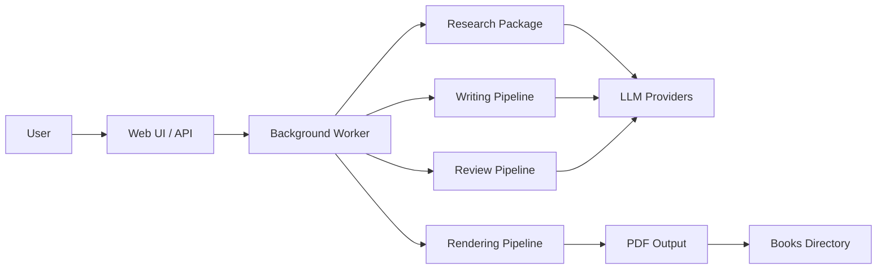

# Project Specification

> Version 1.0 — Phase 01

---

## Table of Contents

- [Vision](#vision)
- [Scope](#scope)
- [Supported Topics](#supported-topics)
- [System Overview](#system-overview)
- [Package Responsibilities](#package-responsibilities)
- [App Responsibilities](#app-responsibilities)
- [Technology Stack](#technology-stack)
- [Constraints](#constraints)
- [Non-Goals](#non-goals)

---

## Vision

BookForge AI is an AI-powered platform that produces professional-grade technical eBooks with minimal human intervention. It transforms a topic specification into a fully formatted, publication-ready PDF through an automated pipeline of research, writing, review, and rendering.

The platform targets authors, educators, and organisations who need high-quality technical content at scale — covering AI, DevOps, cloud infrastructure, cybersecurity, and software engineering.

---

## Scope

BookForge AI covers the entire book creation lifecycle:

1. **Topic Definition** — Specify a topic, outline, and target audience
2. **Research** — Gather and synthesise relevant technical information
3. **Writing** — Generate chapters, sections, code examples, and explanations
4. **Review** — Multi-stage quality assurance (technical, stylistic, structural)
5. **Formatting** — Convert to professional Markdown and then to PDF
6. **Publishing** — Output a publication-ready eBook

---

## Supported Topics

Only the following technical categories are allowed:

- Artificial Intelligence
- Machine Learning
- Deep Learning
- LLMs
- AI Agents
- RAG
- AI Infrastructure
- MLOps
- DevOps
- Kubernetes
- Docker
- Cloud
- APIs
- Databases
- Distributed Systems
- Cybersecurity
- Programming
- Software Engineering

Non-technical niches are explicitly out of scope.

---

## System Overview

---

## Package Responsibilities

| Package | Responsibility |
|---|---|
| `core` | Domain entities, book model, orchestration logic, pipeline state machine |
| `shared` | Common types, configuration management, logging, error handling, utilities |
| `llm` | LLM provider abstraction, request/response normalisation, rate limiting, retries |
| `research` | Topic research, content gathering, source synthesis, outline generation |
| `markdown` | Markdown parsing, transformation, linting, formatting, style enforcement |
| `pdf` | PDF compilation from Markdown, styling, table of contents, cover generation |
| `review` | Review pipeline orchestration, quality checks, automated and manual review stages |
| `rag` | Retrieval-Augmented Generation, vector storage, context retrieval, embedding management |
| `diagrams` | Architecture diagram generation (Mermaid, PlantUML), embedding into content |
| `images` | Image generation (via LLM or dedicated models), image processing, optimisation |
| `prompts` | Prompt template management, versioning, rendering, experiment tracking |

---

## App Responsibilities

| App | Responsibility |
|---|---|
| `api` | REST API exposing book CRUD, pipeline control, review actions, status polling |
| `web` | Next.js frontend providing dashboard, book editor, review interface, progress monitoring |
| `worker` | Celery-based background task processor executing pipeline stages asynchronously |

---

## Technology Stack

| Category | Choice | Rationale |
|---|---|---|
| Language | Python 3.12+ | Rich AI/ML ecosystem, type hints, async support |
| API Framework | FastAPI | Async-first, OpenAPI docs, Pydantic validation |
| Web UI | Next.js | Modern React framework, SSR, excellent DX |
| Database | PostgreSQL 16 | Robust, extensible, JSONB support |
| Task Queue | Celery + Redis | Mature async task processing, monitoring |
| PDF Engine | WeasyPrint / Typst | High-quality PDF rendering from HTML/Markdown |
| LLM Providers | NVIDIA NIM, OpenAI, Anthropic, Ollama | Flexibility across cloud and local models |
| Container | Docker, Docker Compose | Reproducible environments, local dev |
| CI/CD | GitHub Actions | Tight GitHub integration |
| Linting | ruff | Fast Python linter and formatter |
| Types | mypy | Static type checking |
| Testing | pytest | Industry standard Python testing |

---

## Constraints

- All generated content must be technically accurate and internally consistent
- The platform must support both cloud-based and local LLM providers
- Generated books must be publication-ready PDFs with table of contents, cover, and proper typography
- The system must handle books ranging from 50 to 500+ pages
- Processing must be resilient to LLM provider failures (retries, fallbacks)

---

## Non-Goals

- Non-technical book genres (fiction, humanities, general business)
- Real-time collaborative editing (Google Docs-style)
- Direct publishing to Amazon Kindle or other marketplaces
- Multi-language book generation (English only for initial releases)
- Conversational or chatbot interfaces
- Video or multimedia content generation
