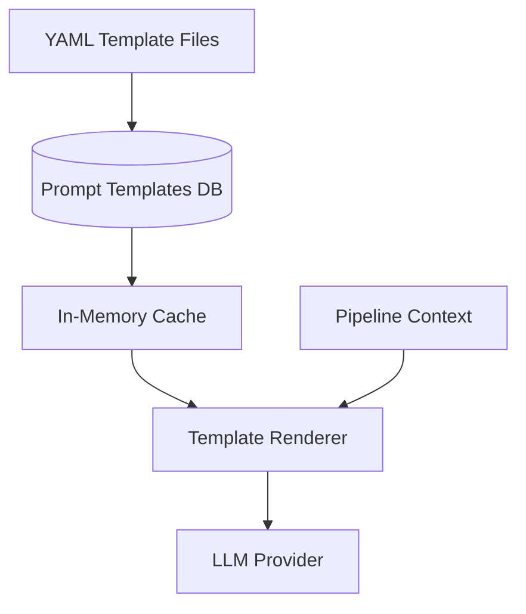

# Prompts

> Prompt management, templates, and versioning strategy.

---

## Table of Contents

- [Overview](#overview)
- [Prompt Template System](#prompt-template-system)
- [Template Catalog](#template-catalog)
- [Versioning](#versioning)
- [Rendering](#rendering)

---

## Overview

The `prompts` package manages all LLM prompt templates used throughout BookForge AI. Templates are versioned, reusable, and parameterised to adapt to different contexts while maintaining consistent quality.

---

## Prompt Template System



Templates are stored both as YAML files in the repository and as records in the database. At runtime, templates are loaded into an in-memory cache for fast rendering.

---

## Template Catalog

| Template Name | Purpose | Variables |
|---|---|---|
| `chapter-writer` | Generate chapter content | `topic`, `outline`, `style`, `audience`, `context` |
| `section-writer` | Generate section within chapter | `chapter_title`, `section_title`, `prerequisites` |
| `code-example` | Generate code examples | `concept`, `language`, `difficulty` |
| `technical-review` | Review technical accuracy | `content`, `domain`, `claims` |
| `style-review` | Review style and tone | `content`, `style_guide` |
| `structural-review` | Review content structure | `content`, `outline` |
| `outline-generator` | Generate chapter outline | `topic`, `chapters`, `depth` |
| `research-synthesis` | Synthesise research | `sources`, `topic` |
| `diagram-description` | Generate diagram from text | `concept`, `diagram_type` |

---

## Versioning

- Templates use semantic versioning (`MAJOR.MINOR.PATCH`)
- Breaking changes to template variables increment the MAJOR version
- New optional variables increment the MINOR version
- Fixes and non-functional changes increment the PATCH version
- The active version is recorded in the pipeline event for reproducibility

```yaml
name: chapter-writer
version: 2.1.0
description: Generates a full chapter with sections and code examples
variables:
  topic:
    type: string
    required: true
  outline:
    type: array
    required: true
  style:
    type: string
    required: false
    default: technical
template: |
  # {{ topic }}

  {{#each outline}}
  ## {{ this.section_title }}

  {{ this.content_prompt }}
  {{/each}}
```

---

## Rendering

Templates use the [Jinja2](https://jinja.palletsprojects.com/) templating engine. The renderer:

1. Loads the template by name and version
2. Validates that all required variables are provided
3. Resolves any variable references to RAG context
4. Renders the final prompt string
5. Returns the rendered prompt with metadata

### Rendering Pipeline

```python
template = prompts.load("chapter-writer", version="2.1.0")
rendered = template.render(
    topic="Kubernetes Pod Autoscaling",
    outline=[{"section_title": "HPA Overview", "content_prompt": "..."}],
    style="beginner-friendly"
)
# Rendered string ready for LLM consumption
```
