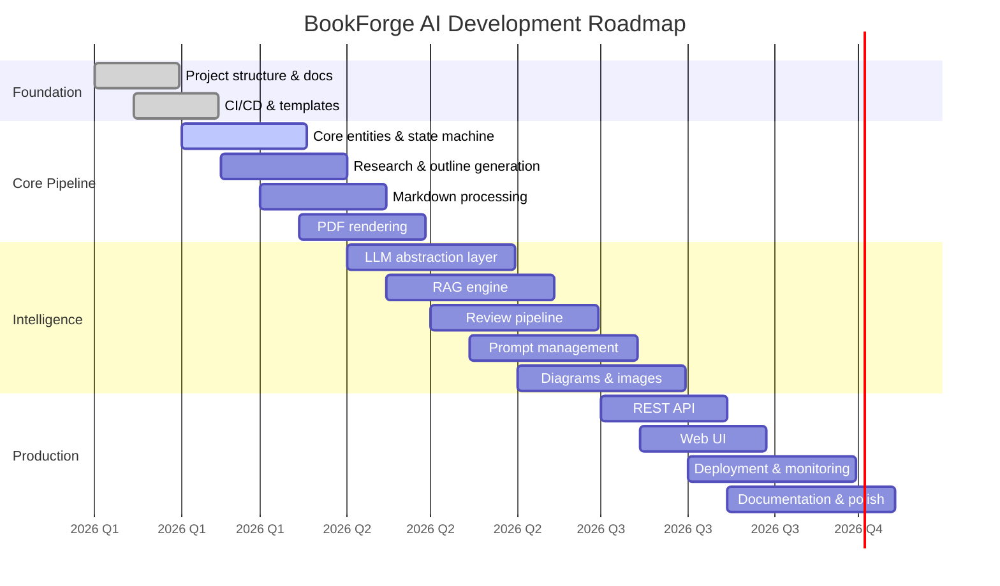

# Roadmap

> Development phases and future direction for BookForge AI.

---

## Table of Contents

- [Phase Overview](#phase-overview)
- [Phase 01 — Foundation](#phase-01--foundation)
- [Phase 02 — Core Pipeline](#phase-02--core-pipeline)
- [Phase 03 — Intelligence](#phase-03--intelligence)
- [Phase 04 — Production](#phase-04--production)
- [Future Considerations](#future-considerations)

---

## Phase Overview

---

## Phase 01 — Foundation

**Status:** ✅ Complete

**Goal:** Establish the project foundation with no AI logic.

| Deliverable | Description |
|---|---|
| Project structure | Monorepo layout with `apps/`, `packages/`, `docs/`, `templates/` |
| Documentation | Full documentation suite (architecture, roadmap, workflow, pipeline, etc.) |
| Package READMEs | Responsibility documentation for every package and app |
| Templates | Book, chapter, and section YAML/Markdown templates |
| CI/CD | GitHub Actions for lint, type-check, and test |
| Configuration | `docker-compose.yml`, `Makefile`, `.env.example` |
| Coding standards | Python style guide, commit conventions, branching strategy |

---

## Phase 02 — Core Pipeline

**Goal:** Implement the core book generation pipeline without LLM integration.

| Deliverable | Package | Description |
|---|---|---|
| Core entities | `core` | Book, Chapter, Section, Author, Pipeline state machine |
| Shared utilities | `shared` | Configuration, types, logging, error handling |
| Markdown processing | `markdown` | Parse, transform, lint, and format Markdown content |
| PDF rendering | `pdf` | Compile Markdown to publication-ready PDF with TOC, cover, headers |
| Research engine | `research` | Topic research, outline generation, source management |
| Template system | `templates` | Template loading, variable substitution, partial rendering |

---

## Phase 03 — Intelligence

**Goal:** Integrate LLM providers to power content generation, review, and enhancement.

| Deliverable | Package | Description |
|---|---|---|
| LLM abstraction | `llm` | Provider interface, NVIDIA NIM, OpenAI, Anthropic, Ollama adapters |
| RAG engine | `rag` | Vector storage, embedding management, context retrieval |
| Review pipeline | `review` | Technical accuracy, style consistency, structural review stages |
| Prompt management | `prompts` | Template versioning, rendering, experiment tracking |
| Diagram generation | `diagrams` | Mermaid and PlantUML generation from content descriptions |
| Image generation | `images` | DALL-E / Stable Diffusion integration for illustrations |

---

## Phase 04 — Production

**Goal:** Build the API and web interface, harden for production.

| Deliverable | App | Description |
|---|---|---|
| REST API | `api` | Full CRUD, pipeline control, review actions, status polling |
| Web UI | `web` | Dashboard, book editor, review interface, progress monitoring |
| Background worker | `worker` | Celery configuration, task routing, error handling |
| DevOps | — | Docker, CI/CD, monitoring with Prometheus/Grafana |
| Documentation | — | User guide, deployment guide, operational runbook |

---

## Future Considerations

- **Multi-language output** — Support for non-English book generation
- **Collaborative review** — Multiple reviewers with commenting and approval workflows
- **Plugin system** — Third-party provider plugins for LLM, images, and diagrams
- **Batch generation** — Generate multiple books from a single specification
- **Version tracking** — Track book revisions and regenerate specific chapters
- **Marketplace integration** — Direct publishing to Kindle, Gumroad, or Leanpub
