# Workflow

> End-to-end workflows for BookForge AI — from specification to published book.

---

## Table of Contents

- [Workflow Philosophy](#workflow-philosophy)
- [User-Facing Workflows](#user-facing-workflows)
- [System Workflows](#system-workflows)
- [Workflow Orchestration](#workflow-orchestration)
- [Exception Workflows](#exception-workflows)

---

## Workflow Philosophy

Every workflow in BookForge AI follows three principles:

1. **Asynchronous by default** — No user waits synchronously for an LLM to generate content. Every action that takes longer than 1 second executes in the background.
2. **Observable at every step** — Users can see what stage is running, how long it has been running, and what the estimated remaining time is.
3. **Resumable from failure** — No workflow restarts from scratch after a failure. Checkpoints ensure recovery from the last successful step.

---

## User-Facing Workflows

### 1. Create a Book

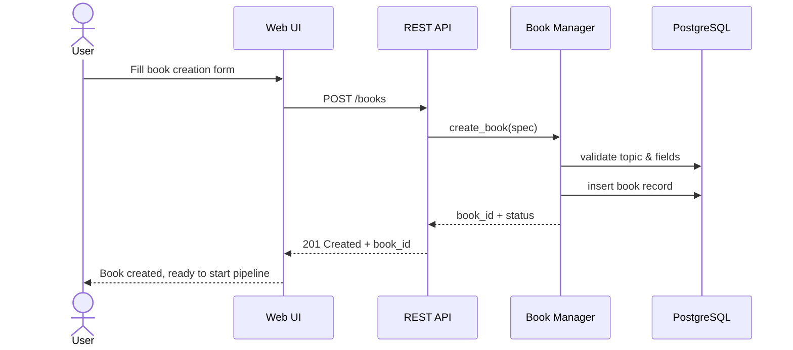

**User sees:** Confirmation with book ID and status "draft". Button to start the pipeline.

---

### 2. Start and Monitor the Pipeline

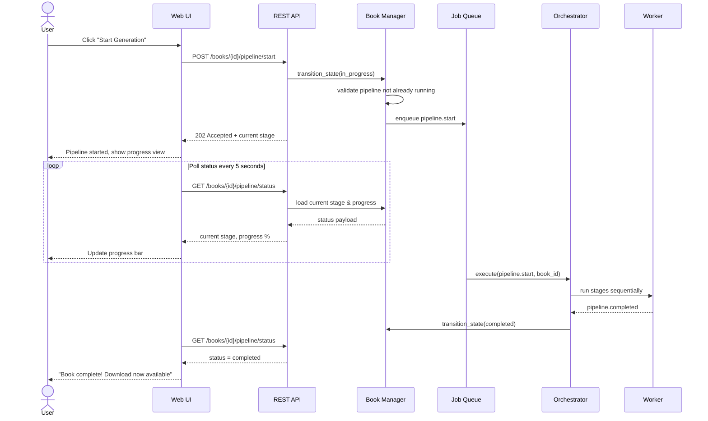

**User sees:** A progress view showing:
- Current stage name with icon
- Overall progress bar (% complete)
- Per-stage status (pending, running, completed, failed)
- Estimated time remaining
- "Cancel" button (only when running)

---

### 3. Review and Revise

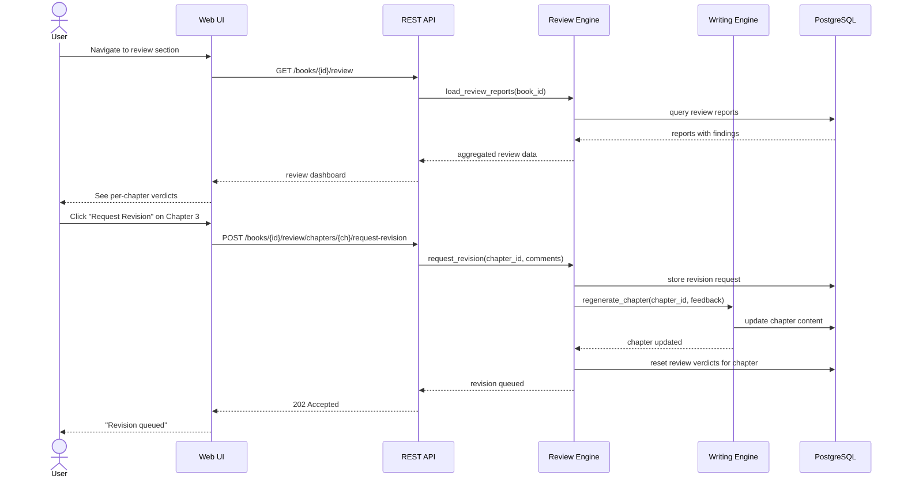

**User sees:** Review dashboard with:
- Per-chapter verdict cards (pass/fail)
- Expandable findings per review stage
- "Approve" and "Request Revision" buttons
- Revision cycle counter
- Comment box for revision requests

---

### 4. Download Completed Book

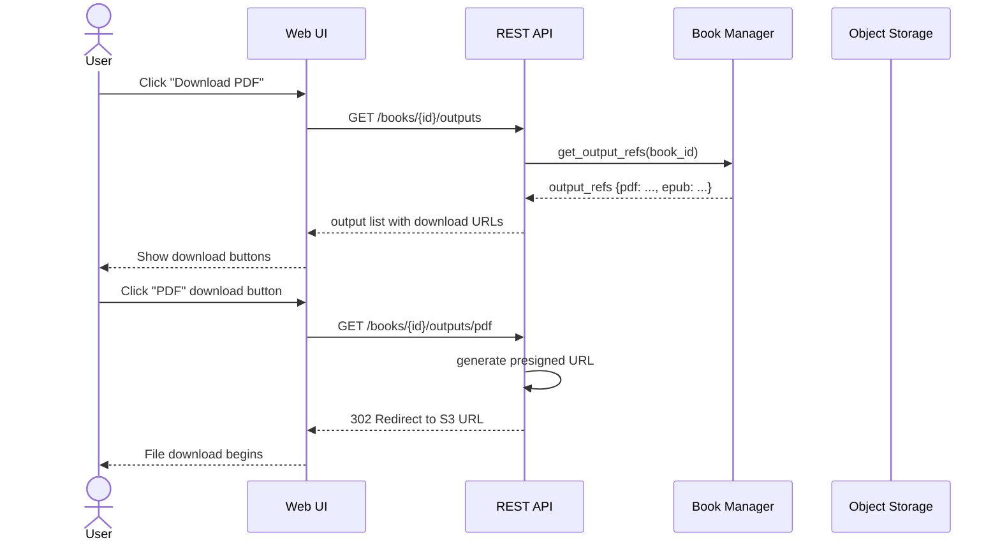

**User sees:** Download buttons for PDF and EPUB formats. File sizes displayed. Cover thumbnail shown.

---

### 5. Manage Projects and Collaborators

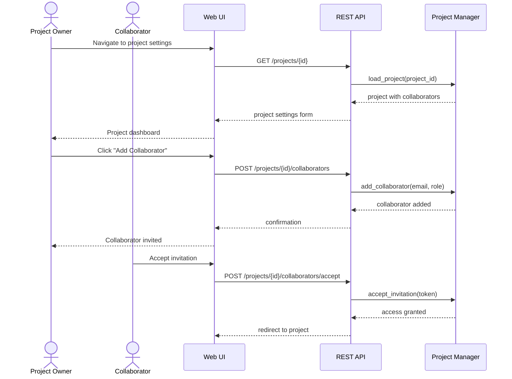

**User sees (Owner):** Collaborator list with roles, invite form, remove button.
**User sees (Collaborator):** Project in shared projects list, access to books.

---

## System Workflows

### 6. Provider Health Monitoring

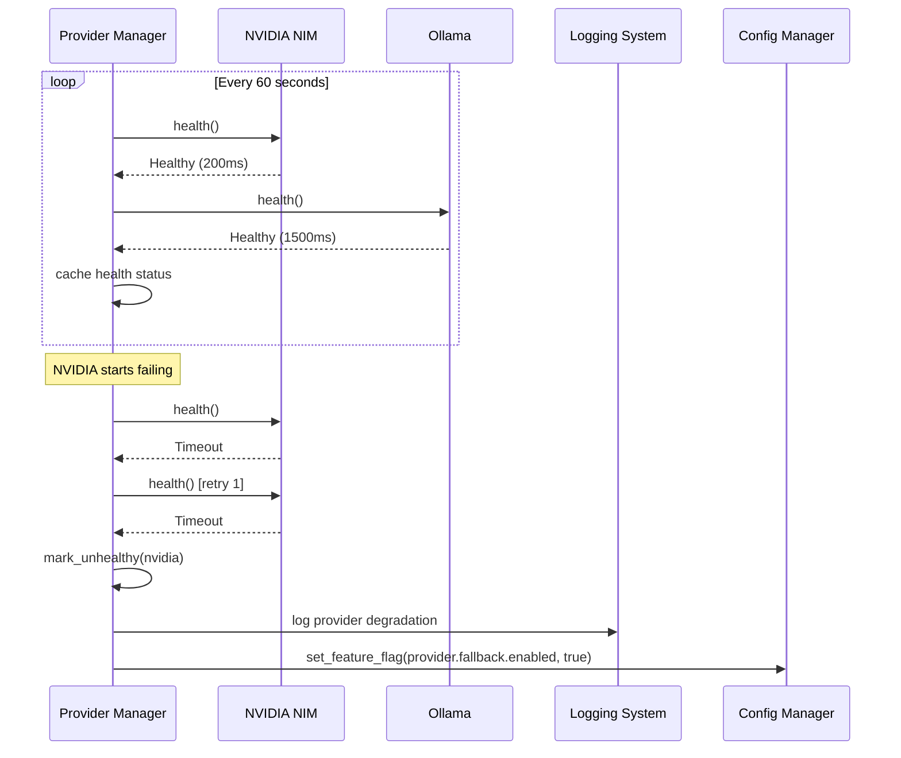

---

### 7. Pipeline Checkpoint Recovery

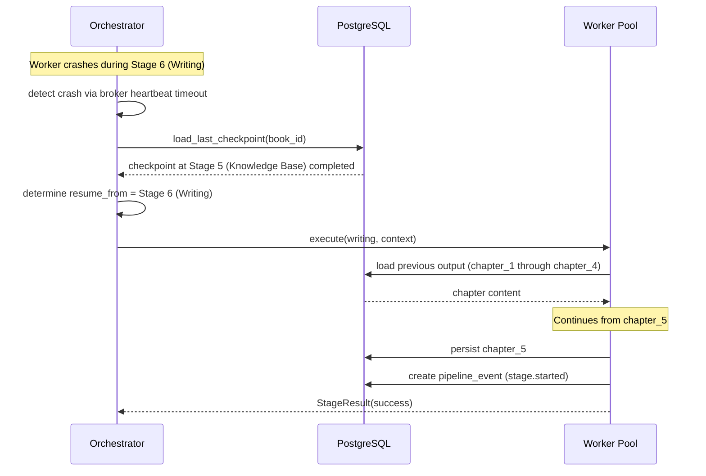

---

### 8. Configuration Reload

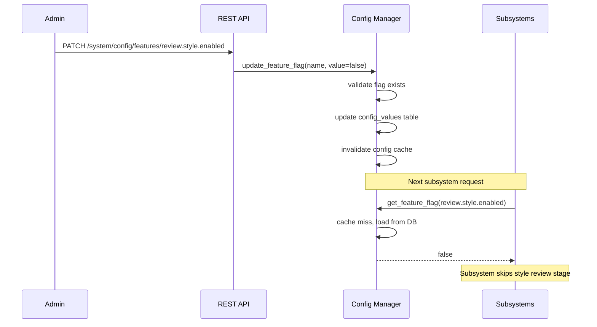

---

## Workflow Orchestration

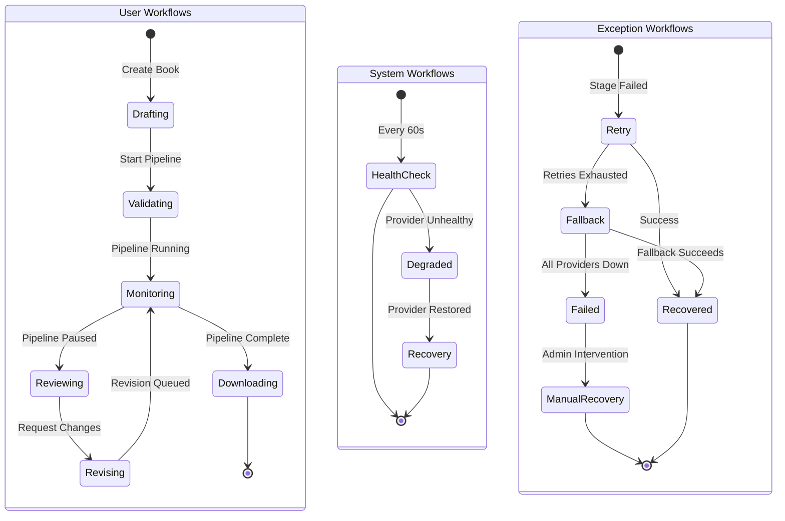

---

## Exception Workflows

### Provider Failure During Generation

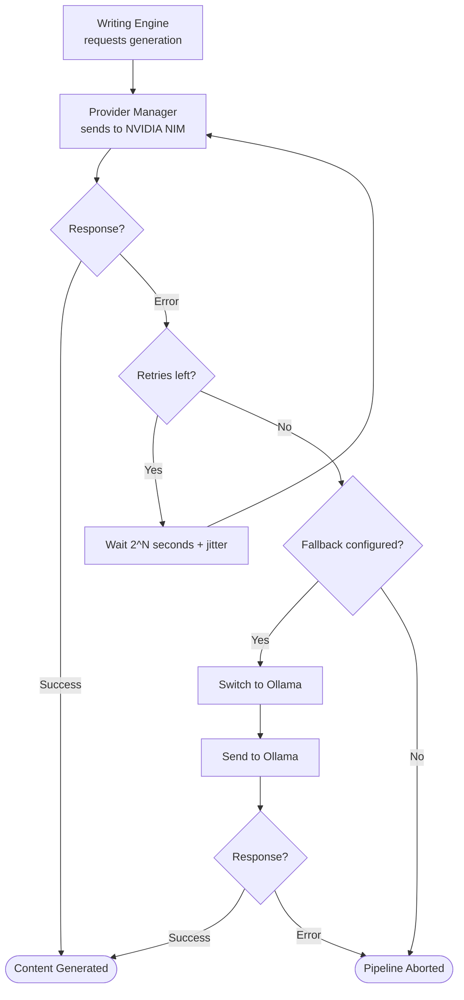

### Pipeline Stage Timeout

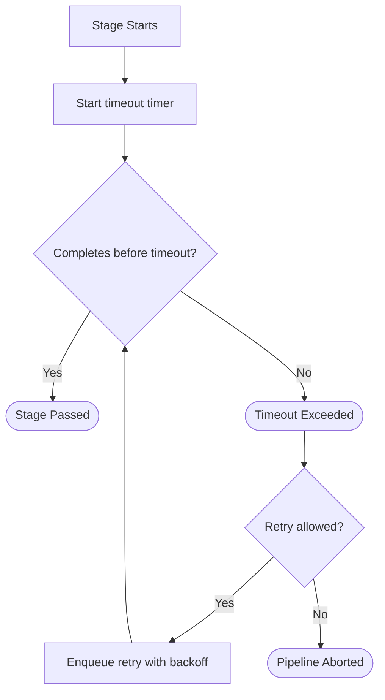

### Manual Intervention Required

When automatic recovery fails, the pipeline enters a `failed` state and the system:
1. Persists all completed work up to the failure point
2. Logs the full error context with trace ID
3. Sends an alert via the configured webhook
4. Waits for manual intervention (API or dashboard)

An admin can:
- **Retry** the failed stage with modified configuration
- **Skip** the failed stage and continue
- **Roll back** to a previous checkpoint
- **Cancel** the pipeline entirely
