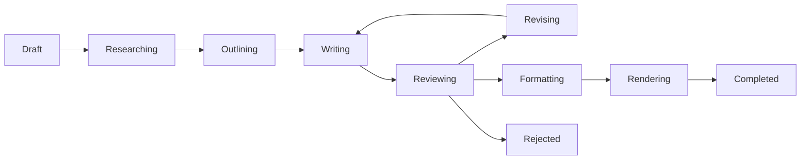
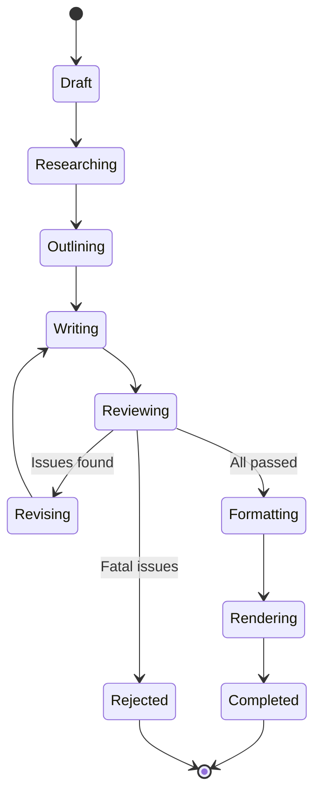

# Workflow

> End-to-end book creation workflow in BookForge AI.

---

## Table of Contents

- [Overview](#overview)
- [Workflow Stages](#workflow-stages)
- [Stage Details](#stage-details)
- [State Machine](#state-machine)

---

## Overview

The book creation workflow follows a sequential pipeline with optional review loops. Each stage is executed by the background worker and advances the book through a defined state machine.

---

## Workflow Stages

| Stage | Description | Responsible Package |
|---|---|---|
| Draft | User defines topic, audience, and outline | `core` |
| Researching | System gathers and synthesises technical sources | `research` |
| Outlining | System generates structured chapter outline | `research` |
| Writing | System writes chapter content via LLM | `llm`, `prompts` |
| Reviewing | Automated and optional manual review | `review` |
| Revising | Content is regenerated based on review feedback | `llm`, `prompts` |
| Formatting | Content is formatted to markdown standards | `markdown` |
| Rendering | Markdown is compiled into PDF | `pdf` |
| Completed | Book is available for download | — |

---

## Stage Details

### 1. Draft

The user provides:
- **Title** — Book title
- **Topic** — Technical domain from the supported list
- **Audience** — Target reader level (beginner, intermediate, advanced)
- **Outline** — Optional chapter-level structure
- **Length** — Target page count or chapter count
- **Style** — Tone and style preferences

The system validates the topic against the allowed list and creates the book record.

### 2. Researching

The research package:
- Queries the LLM for structured research on each chapter topic
- Cross-references information for consistency
- Identifies key concepts, prerequisites, and learning objectives
- Produces a research corpus attached to the book

### 3. Outlining

The outline generator:
- Produces a chapter-by-chapter breakdown
- Defines section structure within each chapter
- Identifies where code examples, diagrams, and tables are needed
- Assigns approximate page allocations per section

### 4. Writing

The writing engine:
- Generates content chapter by chapter using the LLM
- Uses prompt templates from the prompts package
- Retrieves relevant context via the RAG engine for cross-chapter consistency
- Inserts diagrams and images at defined points
- Generates code examples with syntax annotations

### 5. Reviewing

The review pipeline performs:
- **Technical review** — Factual accuracy, code correctness
- **Style review** — Consistent tone, terminology, formatting
- **Structural review** — Logical flow, chapter transitions, completeness
- **Consistency review** — Terminology consistency across chapters

Each review stage can pass or request revision.

### 6. Revising

When a review stage requests changes:
- The system feeds review comments back to the LLM
- Specific sections are regenerated or modified
- The review cycle repeats until all checks pass

### 7. Formatting

The markdown package:
- Normalises heading hierarchy
- Ensures consistent code block styling
- Generates cross-references and internal links
- Builds the table of contents
- Applies typographic conventions

### 8. Rendering

The PDF package:
- Compiles the markdown into a styled PDF document
- Generates the cover page
- Renders diagrams and images
- Produces headers, footers, and page numbers
- Outputs the final file to the `books/` directory

---

## State Machine

